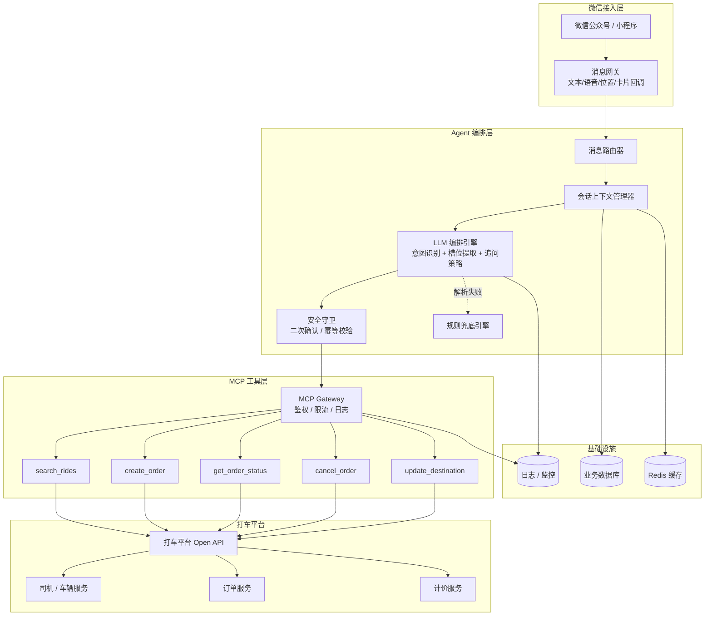
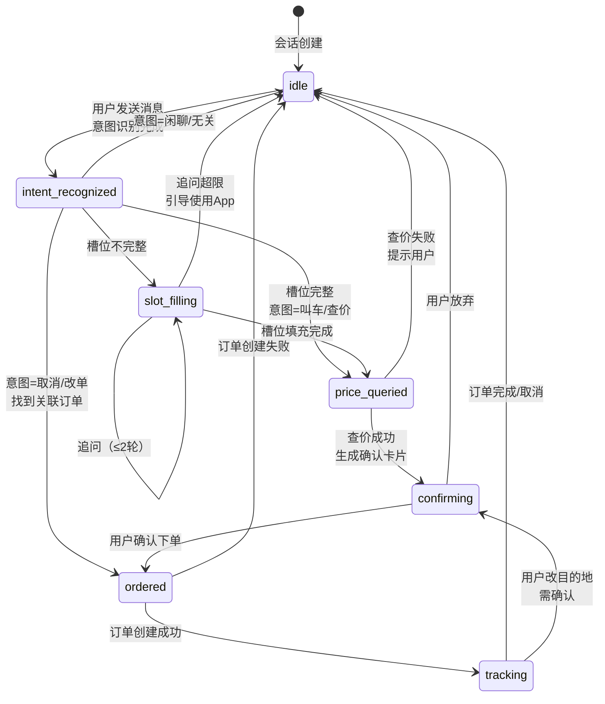
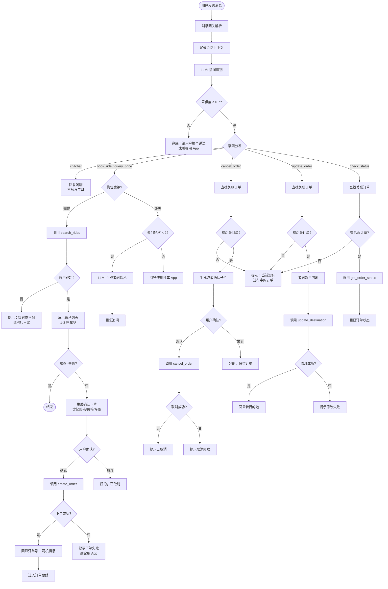
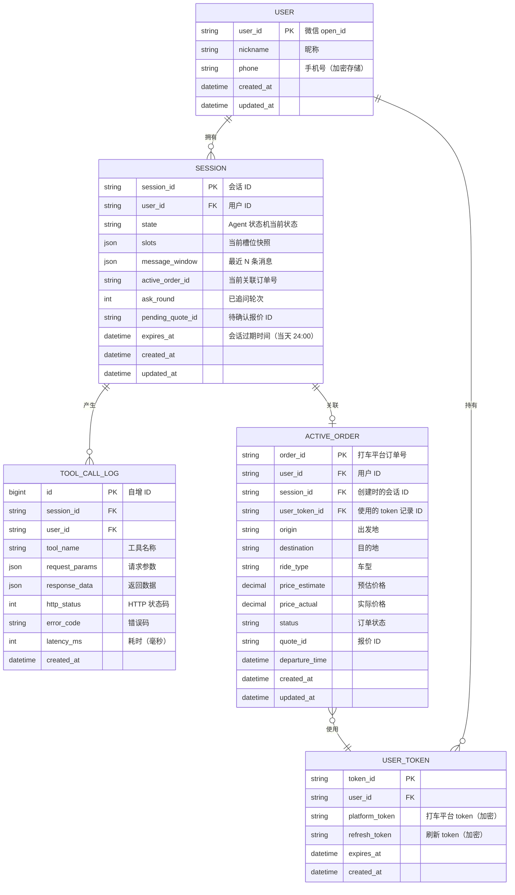
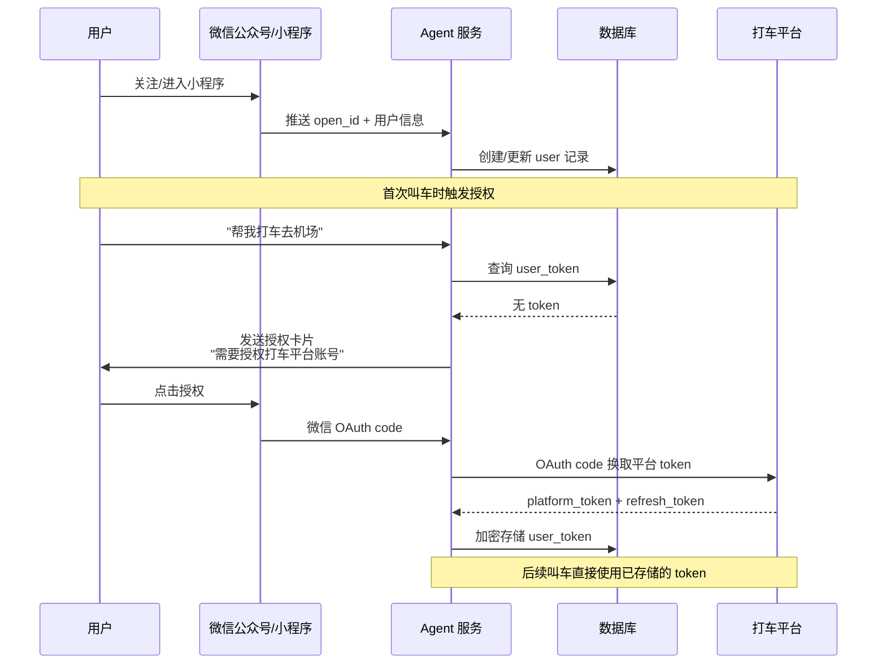
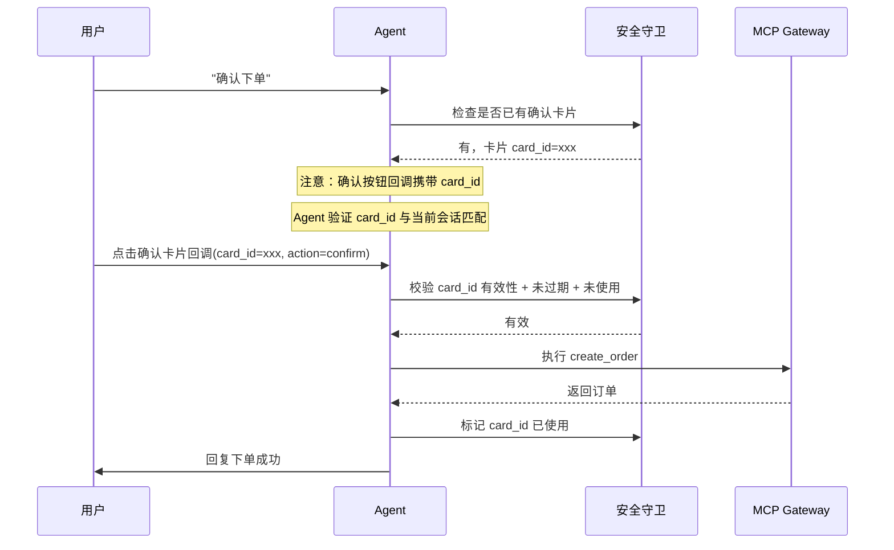
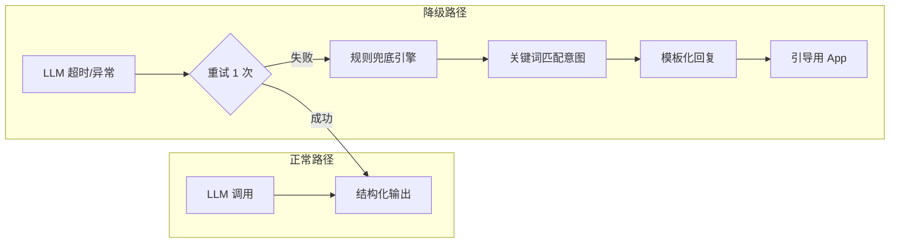
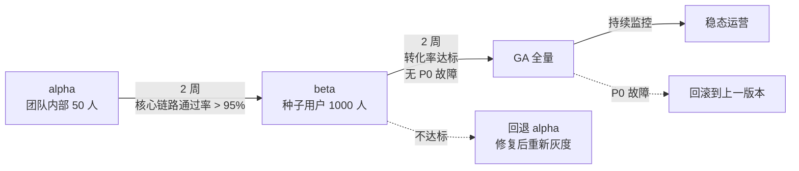

# 微信 AI 打车助手 — 功能规格文档（FSD）

---

## 1. 文档头信息

| 字段 | 内容 |
|---|---|
| 文档名 | 微信 AI 打车助手 FSD（Functional Specification Document） |
| 版本 | v0.1 |
| 作者 / 日期 | 产品技术组 / 2026-08-16 |
| 状态 | 待评审 |
| 前置文档 | PRD v0.1（做什么：核心链路、MCP 工具清单、模型约束、防护兜底） |
| 后续文档 | 技术设计文档 TDD（具体实现细节）、测试计划 |
| 适用范围 | v0.1 单平台、文字指令、四意图、二次确认 |

> 💡 **FSD 的定位**：PRD 回答「做什么」，FSD 回答「怎么做」。本文档是研发可直接对照编码的规格说明，覆盖 Agent 编排、MCP 接口、数据模型、安全鉴权、性能降级、监控部署全链路。

---

## 2. 系统架构设计

### 2.1 整体架构图



### 2.2 组件职责说明

| 组件 | 职责 | 技术选型建议 |
|---|---|---|
| **消息网关** | 接收微信消息（文本/语音/位置/卡片回调），统一转为内部消息格式 | 微信开放平台 SDK + 自建适配层 |
| **消息路由器** | 按消息类型分发到 Agent 或回调处理器 | 轻量路由，无状态 |
| **会话上下文管理器** | 维护用户会话状态、历史消息、当前订单号；负责上下文窗口裁剪 | Redis（热数据）+ DB（冷数据） |
| **LLM 编排引擎** | 执行意图识别、槽位提取、追问生成、确认话术；管理 Tool Calling 循环 | LLM API（如 GPT-4o / Claude） |
| **安全守卫** | 拦截有后果操作，强制二次确认；幂等校验防重复下单 | 确定性规则引擎 |
| **规则兜底引擎** | LLM 输出不可解析时，走关键词匹配的规则降级路径 | 正则 + 关键词表 |
| **MCP Gateway** | 统一鉴权、限流、超时控制、调用日志；封装 5 个 MCP 工具 | 自建网关 |
| **业务数据库** | 持久化会话、订单映射、工具调用日志 | PostgreSQL / MySQL |
| **Redis 缓存** | 会话上下文热存储、热点路线价格缓存、限流计数 | Redis Cluster |

### 2.3 数据流向

```
用户微信消息
  → [消息网关] 解析为统一消息体 {userId, type, content, timestamp}
  → [路由器] 判断消息类型：文本/语音 → Agent；卡片回调 → 安全守卫
  → [上下文管理器] 加载会话上下文（历史消息、当前订单、用户画像）
  → [LLM 编排引擎] 意图识别 → 槽位提取 → 决策下一步动作
  → [安全守卫] 若有后果操作，生成确认卡片，等待用户回调
  → [MCP Gateway] 鉴权 + 限流检查 → 调用具体工具
  → [打车平台 API] 返回业务结果
  → [LLM 编排引擎] 基于工具返回值生成自然语言回复（禁止幻觉）
  → [消息网关] 推送回复到微信
  → [上下文管理器] 更新会话状态，写日志
```

> 💡 **架构决策**：Agent 编排层与 MCP 工具层解耦。LLM 不直接调用打车平台 API，而是通过 MCP Gateway 统一管控。这样 LLM 换模型、打车平台换供应商，都不影响对方。

---

## 3. AI Agent 编排逻辑

### 3.1 Agent 状态机



**状态说明**：

| 状态 | 含义 | 允许的转换 |
|---|---|---|
| `idle` | 空闲，等待用户输入 | → intent_recognized |
| `intent_recognized` | 意图已识别，进入后续分支 | → slot_filling / price_queried / ordered / idle |
| `slot_filling` | 槽位追填中（最多 2 轮） | → price_queried / idle |
| `price_queried` | 已查到价格，等待用户选择 | → confirming / idle |
| `confirming` | 确认卡片已发出，等待用户点击 | → ordered / idle |
| `ordered` | 订单已创建 | → tracking / idle |
| `tracking` | 订单跟踪中 | → idle / confirming（改目的地） |

### 3.2 Prompt 工程设计

#### 3.2.1 System Prompt 模板

```text
你是「微信 AI 打车助手」，帮助用户在微信中完成打车相关操作。

## 你的能力
1. 叫车：帮用户查询价格并下单
2. 查价：查询路线价格，不下单
3. 取消订单：取消用户已有的订单
4. 修改目的地：修改进行中订单的目的地

## 核心规则
- **禁止幻觉**：价格、司机信息、时间、车牌等事实字段只能来自工具返回值，绝对不可以自行编造。
- **禁止跳过确认**：create_order、cancel_order 调用前必须获得用户明确确认。
- **槽位规则**：
  - 出发地缺失 → 默认为用户当前定位（需告知用户）
  - 目的地缺失 → 必须追问，禁止代填
  - 时间模糊（「一会儿」「等一下」）→ 追问或默认「现在」并明示
  - 车型缺失 → 默认推荐「经济型」并明示
- **追问上限**：最多追问 2 轮。超过 2 轮引导用户使用打车 App。
- **订单上下文**：当前会话中如有未完成订单，槽位中的「订单号」自动关联。
- **跨天不继承**：每日 00:00 后新会话不继承前一天的订单上下文。

## 输出格式
- 回复简洁，适合微信聊天场景，不超过 200 字。
- 金额显示格式：¥XX.XX（保留两位小数）。
- 需要用户确认时，输出确认卡片标记：<CONFIRM_CARD>...</CONFIRM_CARD>。
```

#### 3.2.2 意图识别 Prompt 模板

```text
## 任务
分析用户消息，识别意图。

## 意图类别
- book_ride：叫车（含「打车」「叫车」「帮我约车」等）
- query_price：查价（含「多少钱」「查一下价格」等，明确不下单）
- cancel_order：取消订单（含「取消」「不要了」「退掉」等）
- update_order：改单（含「改目的地」「换个地方」等）
- chitchat：闲聊或与打车无关的消息
- check_status：查订单状态（含「司机到哪了」「还要多久」等）

## 输出 JSON
{
  "intent": "意图类别",
  "confidence": 0.0-1.0,
  "reasoning": "判断理由（简要）"
}

## 规则
- confidence < 0.7 时，intent 设为 "uncertain"
- 如果消息同时包含多个意图（如「取消上一个，帮我重新叫」），取第一个动作，并在 reasoning 中说明
```

#### 3.2.3 槽位提取 Prompt 模板

```text
## 任务
从用户消息中提取叫车所需的槽位信息。

## 槽位定义
- origin：出发地（地址或 POI 名称）
- destination：目的地（地址或 POI 名称）
- departure_time：出发时间（ISO 8601 格式或 "now"）
- ride_type：车型（economy/comfort/premium/taxi）

## 上下文
- 用户当前定位：{user_location}
- 当前时间：{current_time}
- 会话历史订单号：{active_order_id}

## 输出 JSON
{
  "slots": {
    "origin": { "value": "...", "source": "user_input|location_default|missing" },
    "destination": { "value": "...", "source": "user_input|missing" },
    "departure_time": { "value": "...", "source": "user_input|time_default|missing" },
    "ride_type": { "value": "...", "source": "user_input|type_default|missing" }
  },
  "missing_required": ["destination"]
}

## 规则
- destination 的 source 只能是 "user_input" 或 "missing"，禁止代填
- origin 缺省时 source = "location_default"，value = 用户当前定位
- departure_time 模糊表达（「一会儿」）→ source = "time_default"，value = "now"
- ride_type 缺省 → source = "type_default"，value = "economy"
```

#### 3.2.4 追问策略 Prompt

```text
## 任务
根据缺失槽位，生成追问话术。

## 缺失槽位
{missing_slots}

## 已追问轮次
{ask_round} / 2

## 追问优先级
1. destination（必须）
2. ride_type（可默认）
3. departure_time（可默认）

## 规则
- 一次最多追问 2 个缺失槽位
- 话术口语化、简短（微信聊天风格）
- 给出示例引导用户（如「比如：去首都机场」）
- 如果 ask_round >= 2，不再追问，输出引导：「建议打开打车 App 操作，更方便哦～」
```

### 3.3 Tool Calling 协议

以下为 Agent 可用的 5 个工具函数定义（JSON Schema 格式）。Agent 通过 function calling 机制调用。

```json
{
  "tools": [
    {
      "type": "function",
      "function": {
        "name": "search_rides",
        "description": "查询指定路线的可用车辆和价格。返回 1-3 档车型的价格、预估时长和可用车辆数。",
        "parameters": {
          "type": "object",
          "properties": {
            "origin": {
              "type": "string",
              "description": "出发地地址或 POI 名称",
              "example": "西二旗地铁站"
            },
            "origin_lat": {
              "type": "number",
              "description": "出发地纬度（优先使用坐标）"
            },
            "origin_lng": {
              "type": "number",
              "description": "出发地经度"
            },
            "destination": {
              "type": "string",
              "description": "目的地地址或 POI 名称",
              "example": "首都国际机场 T3"
            },
            "destination_lat": {
              "type": "number",
              "description": "目的地纬度"
            },
            "destination_lng": {
              "type": "number",
              "description": "目的地经度"
            },
            "departure_time": {
              "type": "string",
              "description": "出发时间，ISO 8601 格式。'now' 表示立即出发",
              "example": "2026-08-16T18:30:00+08:00"
            },
            "ride_type": {
              "type": "string",
              "enum": ["economy", "comfort", "premium", "taxi", "all"],
              "description": "车型筛选，'all' 返回所有车型"
            }
          },
          "required": ["origin", "destination", "departure_time"]
        }
      }
    },
    {
      "type": "function",
      "function": {
        "name": "create_order",
        "description": "创建打车订单。此操作会产生费用，必须在用户确认后调用。",
        "parameters": {
          "type": "object",
          "properties": {
            "origin": {
              "type": "string",
              "description": "出发地地址"
            },
            "origin_lat": { "type": "number" },
            "origin_lng": { "type": "number" },
            "destination": {
              "type": "string",
              "description": "目的地地址"
            },
            "destination_lat": { "type": "number" },
            "destination_lng": { "type": "number" },
            "ride_type": {
              "type": "string",
              "enum": ["economy", "comfort", "premium", "taxi"],
              "description": "选择的车型"
            },
            "departure_time": {
              "type": "string",
              "description": "出发时间，ISO 8601 格式"
            },
            "user_token": {
              "type": "string",
              "description": "用户身份 token，由系统自动注入，Agent 不填写"
            },
            "quote_id": {
              "type": "string",
              "description": "查价返回的报价 ID，用于锁定价格（有效期 5 分钟）"
            }
          },
          "required": ["origin", "destination", "ride_type", "departure_time", "user_token", "quote_id"]
        }
      }
    },
    {
      "type": "function",
      "function": {
        "name": "get_order_status",
        "description": "查询订单当前状态。",
        "parameters": {
          "type": "object",
          "properties": {
            "order_id": {
              "type": "string",
              "description": "订单号",
              "example": "ORD20260816001234"
            }
          },
          "required": ["order_id"]
        }
      }
    },
    {
      "type": "function",
      "function": {
        "name": "cancel_order",
        "description": "取消订单。可能产生取消费用。必须在用户确认后调用。",
        "parameters": {
          "type": "object",
          "properties": {
            "order_id": {
              "type": "string",
              "description": "订单号"
            },
            "reason": {
              "type": "string",
              "enum": ["user_request", "driver_delay", "change_plan", "other"],
              "description": "取消原因"
            }
          },
          "required": ["order_id", "reason"]
        }
      }
    },
    {
      "type": "function",
      "function": {
        "name": "update_destination",
        "description": "修改进行中订单的目的地。可能导致价格变化，需用户确认。",
        "parameters": {
          "type": "object",
          "properties": {
            "order_id": {
              "type": "string",
              "description": "订单号"
            },
            "new_destination": {
              "type": "string",
              "description": "新目的地地址"
            },
            "new_destination_lat": { "type": "number" },
            "new_destination_lng": { "type": "number" }
          },
          "required": ["order_id", "new_destination"]
        }
      }
    }
  ]
}
```

### 3.4 编排流程图



### 3.5 多轮对话上下文管理策略

#### 上下文窗口结构

```json
{
  "session_id": "sess_abc123",
  "user_id": "wx_user_001",
  "created_at": "2026-08-16T10:00:00+08:00",
  "expires_at": "2026-08-17T00:00:00+08:00",
  "state": "confirming",
  "ask_round": 1,
  "active_order_id": "ORD20260816001234",
  "intent_history": [
    { "turn": 1, "intent": "book_ride", "confidence": 0.96 }
  ],
  "slots": {
    "origin": { "value": "西二旗地铁站", "source": "location_default" },
    "destination": { "value": "首都国际机场 T3", "source": "user_input" },
    "departure_time": { "value": "now", "source": "time_default" },
    "ride_type": { "value": "economy", "source": "type_default" }
  },
  "tool_call_history": [
    {
      "tool": "search_rides",
      "request": { "..." : "..." },
      "response": { "..." : "..." },
      "timestamp": "2026-08-16T10:01:30+08:00"
    }
  ],
  "pending_quote_id": "quote_xyz789",
  "message_window": [
    { "role": "user", "content": "帮我打车去机场" },
    { "role": "assistant", "content": "好的，去哪个机场呢？首都还是大兴？" },
    { "role": "user", "content": "首都 T3" }
  ]
}
```

#### 管理规则

| 规则 | 说明 |
|---|---|
| **消息窗口上限** | 最近 10 条消息（5 轮），超出部分截断，保留 system prompt |
| **跨天不继承** | 每日 00:00 后，session 过期，新消息创建新 session；active_order_id 不继承 |
| **订单上下文** | 同一 session 内，active_order_id 自动关联到 cancel/update/get_status 调用 |
| **槽位持久化** | 槽位在 session 内持续有效，用户可通过新消息覆盖（如「改去大兴机场」） |
| **quote_id 有效期** | 5 分钟，过期后重新调用 search_rides |
| **幂等保护** | session 内已有未完成订单时，拒绝再次 create_order，提示用户已有订单 |

> 💡 **上下文策略决策**：选择 10 条消息窗口而非 token 数截断，因为微信聊天消息短，按条截断更可控。跨天不继承是为了避免「昨天的订单号被误用到今天」。

---

## 4. MCP Server 接口规格

### 4.1 search_rides — 查价/查车

| 属性 | 说明 |
|---|---|
| **函数名** | `search_rides` |
| **描述** | 查询指定路线的可用车辆和预估价格，返回 1-3 档车型选项 |
| **幂等性** | 是（查询操作） |
| **限流** | 单用户 10 次/分钟，全局 1000 QPS |
| **超时** | 5 秒 |

**请求参数 JSON Schema**：

```json
{
  "type": "object",
  "properties": {
    "origin": {
      "type": "string",
      "description": "出发地地址或 POI 名称",
      "minLength": 2,
      "maxLength": 100
    },
    "origin_lat": {
      "type": "number",
      "description": "出发地纬度（WGS84）",
      "minimum": -90,
      "maximum": 90
    },
    "origin_lng": {
      "type": "number",
      "description": "出发地经度（WGS84）",
      "minimum": -180,
      "maximum": 180
    },
    "destination": {
      "type": "string",
      "description": "目的地地址或 POI 名称",
      "minLength": 2,
      "maxLength": 100
    },
    "destination_lat": { "type": "number" },
    "destination_lng": { "type": "number" },
    "departure_time": {
      "type": "string",
      "description": "出发时间，ISO 8601 或 'now'",
      "example": "2026-08-16T18:30:00+08:00"
    },
    "ride_type": {
      "type": "string",
      "enum": ["economy", "comfort", "premium", "taxi", "all"],
      "default": "all"
    }
  },
  "required": ["origin", "destination", "departure_time"]
}
```

**返回值 JSON Schema**：

```json
{
  "type": "object",
  "properties": {
    "success": { "type": "boolean" },
    "quote_id": {
      "type": "string",
      "description": "报价 ID，有效期 5 分钟，用于 create_order 锁定价格"
    },
    "options": {
      "type": "array",
      "items": {
        "type": "object",
        "properties": {
          "ride_type": { "type": "string", "enum": ["economy", "comfort", "premium", "taxi"] },
          "ride_type_label": { "type": "string", "example": "经济型" },
          "price_estimate": {
            "type": "number",
            "description": "预估价格（元）"
          },
          "price_range": {
            "type": "object",
            "properties": {
              "min": { "type": "number" },
              "max": { "type": "number" }
            }
          },
          "duration_minutes": { "type": "integer", "description": "预估时长（分钟）" },
          "distance_km": { "type": "number", "description": "距离（公里）" },
          "available_cars": { "type": "integer", "description": "附近可用车辆数" }
        }
      }
    },
    "origin_resolved": { "type": "string", "description": "系统解析后的出发地" },
    "destination_resolved": { "type": "string", "description": "系统解析后的目的地" }
  }
}
```

**错误码**：

| 错误码 | 说明 | Agent 处理 |
|---|---|---|
| `ERR_GEOCODE_FAIL` | 地址无法解析为坐标 | 提示用户补充更详细的地址 |
| `ERR_NO_SERVICE` | 该区域无服务 | 提示暂无可用车辆 |
| `ERR_ROUTE_FAIL` | 路线规划失败 | 提示路线异常，建议用 App |
| `ERR_RATE_LIMIT` | 限流 | 提示稍后再试 |
| `ERR_TIMEOUT` | 超时 | 提示稍后再试 |

**调用示例**：

Request:
```json
{
  "origin": "西二旗地铁站",
  "origin_lat": 40.0589,
  "origin_lng": 116.3107,
  "destination": "首都国际机场 T3",
  "destination_lat": 40.0799,
  "destination_lng": 116.6031,
  "departure_time": "now",
  "ride_type": "all"
}
```

Response:
```json
{
  "success": true,
  "quote_id": "quote_20260816_abc123",
  "options": [
    {
      "ride_type": "economy",
      "ride_type_label": "经济型",
      "price_estimate": 89.5,
      "price_range": { "min": 78.0, "max": 105.0 },
      "duration_minutes": 45,
      "distance_km": 32.5,
      "available_cars": 12
    },
    {
      "ride_type": "comfort",
      "ride_type_label": "舒适型",
      "price_estimate": 128.0,
      "price_range": { "min": 115.0, "max": 145.0 },
      "duration_minutes": 42,
      "distance_km": 32.5,
      "available_cars": 5
    },
    {
      "ride_type": "premium",
      "ride_type_label": "豪华型",
      "price_estimate": 198.0,
      "price_range": { "min": 180.0, "max": 220.0 },
      "duration_minutes": 40,
      "distance_km": 32.5,
      "available_cars": 2
    }
  ],
  "origin_resolved": "西二旗地铁站（海淀区）",
  "destination_resolved": "首都国际机场 T3 航站楼"
}
```

---

### 4.2 create_order — 下单

| 属性 | 说明 |
|---|---|
| **函数名** | `create_order` |
| **描述** | 创建打车订单。有后果操作，必须在用户二次确认后调用 |
| **幂等性** | 否（依赖 quote_id 做幂等，同一 quote_id 只允许一次下单） |
| **限流** | 单用户 3 次/分钟 |
| **超时** | 10 秒 |

**请求参数 JSON Schema**：

```json
{
  "type": "object",
  "properties": {
    "origin": { "type": "string" },
    "origin_lat": { "type": "number" },
    "origin_lng": { "type": "number" },
    "destination": { "type": "string" },
    "destination_lat": { "type": "number" },
    "destination_lng": { "type": "number" },
    "ride_type": {
      "type": "string",
      "enum": ["economy", "comfort", "premium", "taxi"]
    },
    "departure_time": { "type": "string" },
    "user_token": {
      "type": "string",
      "description": "用户身份 token，由系统自动注入"
    },
    "quote_id": {
      "type": "string",
      "description": "search_rides 返回的报价 ID"
    }
  },
  "required": ["origin", "destination", "ride_type", "departure_time", "user_token", "quote_id"]
}
```

**返回值 JSON Schema**：

```json
{
  "type": "object",
  "properties": {
    "success": { "type": "boolean" },
    "order_id": { "type": "string", "description": "订单号" },
    "driver": {
      "type": "object",
      "properties": {
        "name": { "type": "string" },
        "phone": { "type": "string", "description": "虚拟号" },
        "car_model": { "type": "string" },
        "car_color": { "type": "string" },
        "plate_number": { "type": "string" },
        "rating": { "type": "number" }
      }
    },
    "estimated_pickup_minutes": { "type": "integer" },
    "price_estimate": { "type": "number" },
    "status": { "type": "string", "enum": ["pending", "accepted", "arriving"] }
  }
}
```

**错误码**：

| 错误码 | 说明 | Agent 处理 |
|---|---|---|
| `ERR_QUOTE_EXPIRED` | 报价已过期（>5 分钟） | 重新调用 search_rides |
| `ERR_DUPLICATE_ORDER` | 用户已有进行中订单 | 提示用户已有订单，是否要改/取消 |
| `ERR_NO_CAR` | 附近无可用车辆 | 提示暂无车辆，建议稍后或换车型 |
| `ERR_AUTH_FAIL` | 用户 token 无效 | 引导用户重新授权 |
| `ERR_PLATFORM` | 平台内部错误 | 提示暂时无法下单，建议用 App |

---

### 4.3 get_order_status — 查状态

| 属性 | 说明 |
|---|---|
| **函数名** | `get_order_status` |
| **描述** | 查询订单当前状态 |
| **幂等性** | 是 |
| **限流** | 单用户 20 次/分钟 |
| **超时** | 3 秒 |

**请求参数**：

```json
{
  "type": "object",
  "properties": {
    "order_id": { "type": "string", "description": "订单号" }
  },
  "required": ["order_id"]
}
```

**返回值**：

```json
{
  "type": "object",
  "properties": {
    "success": { "type": "boolean" },
    "order_id": { "type": "string" },
    "status": {
      "type": "string",
      "enum": ["pending", "accepted", "driver_arriving", "in_progress", "completed", "cancelled", "abnormal"]
    },
    "status_label": { "type": "string", "example": "司机正在赶来" },
    "driver": { "type": "object" },
    "estimated_arrival_minutes": { "type": "integer" },
    "current_location": {
      "type": "object",
      "properties": {
        "address": { "type": "string" },
        "lat": { "type": "number" },
        "lng": { "type": "number" }
      }
    },
    "price_actual": { "type": "number", "description": "行程结束后才有值" }
  }
}
```

**错误码**：

| 错误码 | 说明 |
|---|---|
| `ERR_ORDER_NOT_FOUND` | 订单不存在 |
| `ERR_AUTH_FAIL` | 无权查看该订单 |

---

### 4.4 cancel_order — 取消

| 属性 | 说明 |
|---|---|
| **函数名** | `cancel_order` |
| **描述** | 取消订单。可能产生取消费用，必须用户确认后调用 |
| **幂等性** | 是（已取消的订单再次取消返回成功） |
| **限流** | 单用户 5 次/分钟 |
| **超时** | 5 秒 |

**请求参数**：

```json
{
  "type": "object",
  "properties": {
    "order_id": { "type": "string" },
    "reason": {
      "type": "string",
      "enum": ["user_request", "driver_delay", "change_plan", "other"]
    }
  },
  "required": ["order_id", "reason"]
}
```

**返回值**：

```json
{
  "type": "object",
  "properties": {
    "success": { "type": "boolean" },
    "order_id": { "type": "string" },
    "cancel_fee": { "type": "number", "description": "取消费用（元），0 表示免费取消" },
    "message": { "type": "string" }
  }
}
```

**错误码**：

| 错误码 | 说明 |
|---|---|
| `ERR_ORDER_NOT_FOUND` | 订单不存在 |
| `ERR_ALREADY_COMPLETED` | 订单已完成，无法取消 |
| `ERR_IN_PROGRESS` | 行程已开始，无法取消（需联系客服） |
| `ERR_AUTH_FAIL` | 无权操作该订单 |

---

### 4.5 update_destination — 改目的地

| 属性 | 说明 |
|---|---|
| **函数名** | `update_destination` |
| **描述** | 修改进行中订单的目的地。可能导致价格变化，需用户确认 |
| **幂等性** | 否 |
| **限流** | 单用户 3 次/分钟 |
| **超时** | 5 秒 |

**请求参数**：

```json
{
  "type": "object",
  "properties": {
    "order_id": { "type": "string" },
    "new_destination": { "type": "string", "minLength": 2 },
    "new_destination_lat": { "type": "number" },
    "new_destination_lng": { "type": "number" }
  },
  "required": ["order_id", "new_destination"]
}
```

**返回值**：

```json
{
  "type": "object",
  "properties": {
    "success": { "type": "boolean" },
    "order_id": { "type": "string" },
    "new_destination_resolved": { "type": "string" },
    "price_delta": { "type": "number", "description": "价格变化（正数=加价，负数=减价）" },
    "new_price_estimate": { "type": "number" }
  }
}
```

**错误码**：

| 错误码 | 说明 |
|---|---|
| `ERR_ORDER_NOT_FOUND` | 订单不存在 |
| `ERR_ORDER_NOT_MODIFIABLE` | 当前状态不允许修改（如已完成/已取消） |
| `ERR_GEOCODE_FAIL` | 新地址无法解析 |
| `ERR_TOO_FAR` | 新目的地偏离原路线过远 |
| `ERR_AUTH_FAIL` | 无权操作该订单 |

> 💡 **接口设计决策**：`create_order` 使用 `quote_id` 做幂等键而非自生成幂等键，因为 quote_id 天然绑定了价格快照，既防重复下单又防价格篡改。

---

## 5. 数据模型设计

### 5.1 ER 图



### 5.2 关键表结构设计

#### user 表

| 字段 | 类型 | 约束 | 说明 |
|---|---|---|---|
| user_id | VARCHAR(64) | PK | 微信 open_id |
| nickname | VARCHAR(100) | | 昵称 |
| phone | VARCHAR(256) | | 手机号（AES 加密存储） |
| created_at | DATETIME | NOT NULL | |
| updated_at | DATETIME | NOT NULL | |

**索引**：`user_id` (PK)

#### session 表

| 字段 | 类型 | 约束 | 说明 |
|---|---|---|---|
| session_id | VARCHAR(64) | PK | UUID |
| user_id | VARCHAR(64) | FK, NOT NULL | |
| state | VARCHAR(32) | NOT NULL | 状态机状态枚举 |
| slots | JSON | | 槽位快照 |
| message_window | JSON | | 最近消息窗口 |
| active_order_id | VARCHAR(64) | | 关联订单号 |
| ask_round | TINYINT | DEFAULT 0 | 追问轮次 |
| pending_quote_id | VARCHAR(128) | | 待确认报价 |
| expires_at | DATETIME | NOT NULL | 会话过期时间 |
| created_at | DATETIME | NOT NULL | |
| updated_at | DATETIME | NOT NULL | |

**索引**：`user_id + expires_at` (查找用户活跃会话)、`active_order_id` (通过订单反查会话)

#### active_order 表

| 字段 | 类型 | 约束 | 说明 |
|---|---|---|---|
| order_id | VARCHAR(64) | PK | 平台订单号 |
| user_id | VARCHAR(64) | FK, NOT NULL | |
| session_id | VARCHAR(64) | FK | |
| user_token_id | VARCHAR(64) | FK | |
| origin | VARCHAR(200) | NOT NULL | |
| destination | VARCHAR(200) | NOT NULL | |
| ride_type | VARCHAR(20) | NOT NULL | |
| price_estimate | DECIMAL(10,2) | | |
| price_actual | DECIMAL(10,2) | | 行程结束后更新 |
| status | VARCHAR(20) | NOT NULL | pending/accepted/... |
| quote_id | VARCHAR(128) | UNIQUE | 报价 ID，幂等键 |
| departure_time | DATETIME | | |
| created_at | DATETIME | NOT NULL | |
| updated_at | DATETIME | NOT NULL | |

**索引**：`user_id + status` (查用户活跃订单)、`quote_id` (UNIQUE，幂等)、`session_id`

#### tool_call_log 表

| 字段 | 类型 | 约束 | 说明 |
|---|---|---|---|
| id | BIGINT | PK, AUTO_INCREMENT | |
| session_id | VARCHAR(64) | FK | |
| user_id | VARCHAR(64) | NOT NULL | |
| tool_name | VARCHAR(32) | NOT NULL | search_rides / create_order / ... |
| request_params | JSON | | 脱敏后的请求参数 |
| response_data | JSON | | 脱敏后的返回数据 |
| http_status | INT | | |
| error_code | VARCHAR(32) | | |
| latency_ms | INT | | |
| created_at | DATETIME | NOT NULL | |

**索引**：`user_id + created_at`、`tool_name + created_at`、`session_id`
**分区**：按 `created_at` 月分区，便于归档

#### user_token 表

| 字段 | 类型 | 约束 | 说明 |
|---|---|---|---|
| token_id | VARCHAR(64) | PK | UUID |
| user_id | VARCHAR(64) | FK, NOT NULL | |
| platform_token | VARCHAR(512) | NOT NULL | AES 加密 |
| refresh_token | VARCHAR(512) | | AES 加密 |
| expires_at | DATETIME | NOT NULL | |
| created_at | DATETIME | NOT NULL | |

**索引**：`user_id` (UNIQUE，一个用户一个平台 token)

### 5.3 数据生命周期管理

| 数据类型 | 热存储（Redis） | 冷存储（DB） | 归档 | 删除 |
|---|---|---|---|---|
| **会话上下文** | 活跃会话（TTL = 当天剩余时间） | session 表保留 30 天 | 30 天后归档到 OSS | 90 天后物理删除 |
| **订单数据** | 进行中订单缓存 | active_order 表永久 | 完成后 1 年归档 | 不删除（合规要求） |
| **工具调用日志** | 不缓存 | tool_call_log 表 90 天 | 90 天后归档 | 180 天后物理删除 |
| **用户 token** | 不缓存 | user_token 表 | 随用户注销删除 | 注销后 30 天物理删除 |

> 💡 **数据生命周期决策**：订单数据不删除是因为网约车管理办法要求运营数据留存不少于 3 年。工具调用日志保留 90 天足够覆盖投诉处理周期。

---

## 6. 安全与鉴权设计

### 6.1 用户身份绑定流程



### 6.2 Token 管理

| 环节 | 策略 |
|---|---|
| **获取** | 微信 OAuth 2.0 → Agent 后端 → 打车平台 token 交换 |
| **存储** | AES-256 加密存储，密钥由 KMS 管理，不存 Redis |
| **刷新** | 过期前 1 小时自动 refresh；refresh 失败引导用户重新授权 |
| **撤销** | 用户取消关注 / 注销 → 调用平台 revoke API → 删除本地记录 |
| **隔离** | 每个用户的 token 独立，不可跨用户使用 |

### 6.3 MCP 调用鉴权

```
Agent 后端                    MCP Gateway                   打车平台 API
   |                              |                              |
   |--- tool_call(user_id) ------>|                              |
   |                              |--- 1. 验证 user_id 有效      |
   |                              |--- 2. 查询 user_token        |
   |                              |--- 3. 校验订单归属           |
   |                              |      (cancel/update 时)      |
   |                              |--- 4. 限流检查               |
   |                              |--- 5. 注入 platform_token -->|
   |                              |                              |
   |                              |<-------- API response -------|
   |<-- tool_result --------------|                              |
```

**鉴权规则**：

| 工具 | 鉴权要求 |
|---|---|
| search_rides | user_token 有效即可 |
| create_order | user_token + quote_id 归属校验 + 幂等检查 |
| get_order_status | user_token + order_id 归属校验（只能查自己的订单） |
| cancel_order | user_token + order_id 归属校验 |
| update_destination | user_token + order_id 归属校验 |

### 6.4 敏感操作二次确认的技术实现

#### 确认卡片机制



#### 确认卡片数据结构

```json
{
  "card_id": "card_20260816_001",
  "session_id": "sess_abc123",
  "action_type": "create_order",
  "created_at": "2026-08-16T10:02:00+08:00",
  "expires_at": "2026-08-16T10:07:00+08:00",
  "used": false,
  "details": {
    "origin": "西二旗地铁站",
    "destination": "首都国际机场 T3",
    "ride_type": "经济型",
    "price_estimate": 89.5,
    "departure_time": "立即出发"
  },
  "quote_id": "quote_20260816_abc123"
}
```

**安全规则**：

| 规则 | 说明 |
|---|---|
| 卡片有效期 | 5 分钟，过期后需重新查价 |
| 一次性使用 | card_id 确认后立即标记 used，防止重放 |
| 会话绑定 | card_id 只允许同一 session_id 内确认 |
| 回显完整信息 | 卡片必须展示起终点、价格、车型，用户可见可核对 |
| 禁止绕过 | MCP Gateway 层校验：create_order 必须携带有效 card_id |

> 💡 **安全设计决策**：确认卡片不是前端装饰，而是后端强校验的凭证。即使 Agent 被 prompt injection 绕过确认步骤，MCP Gateway 层仍然会拒绝没有有效 card_id 的 create_order 调用。这是「纵深防御」策略。

---

## 7. 性能与可扩展性

### 7.1 性能指标分解

PRD 要求：端到端 P95 ≤ 30 秒。各环节耗时预算如下：

| 环节 | P50 目标 | P95 目标 | P99 目标 | 说明 |
|---|---|---|---|---|
| 消息网关接收 | 10ms | 50ms | 100ms | 微信回调 → 内部消息 |
| 上下文加载 | 5ms | 20ms | 50ms | Redis GET |
| **LLM 意图识别** | 800ms | 1500ms | 2000ms | 模型 API 调用 |
| **LLM 槽位提取** | 600ms | 1200ms | 1800ms | 与意图识别合并为一次调用 |
| **LLM 追问生成** | 500ms | 1000ms | 1500ms | 仅在缺槽位时触发 |
| LLM 回复生成 | 400ms | 800ms | 1200ms | 基于工具结果生成话术 |
| **MCP search_rides** | 1000ms | 2500ms | 3000ms | 含平台 API 往返 |
| **MCP create_order** | 1500ms | 3000ms | 5000ms | 含平台 API 往返 |
| MCP 其他工具 | 500ms | 1500ms | 2000ms | |
| 安全守卫校验 | 5ms | 20ms | 50ms | |
| 消息推送 | 50ms | 200ms | 500ms | 微信模板消息/客服消息 |

**典型链路耗时（叫车成功）**：
```
消息接收(50ms) + 上下文加载(20ms) + LLM意图+槽位(1500ms) + MCP search_rides(2500ms)
+ LLM回复(800ms) + 用户确认(异步) + MCP create_order(3000ms) + LLM回复(800ms) + 推送(200ms)
= 约 9 秒（不含用户操作时间）
```

### 7.2 缓存策略

| 缓存项 | Key | TTL | 更新策略 | 说明 |
|---|---|---|---|---|
| 会话上下文 | `session:{session_id}` | 当天剩余时间 | 每次状态变更写入 | Redis Hash |
| 热点路线价格 | `price:{origin_geo_hash}:{dest_geo_hash}:{ride_type}` | 5 分钟 | search_rides 成功后写入 | 相同路线 5 分钟内直接返回缓存 |
| 用户 token | 不缓存 | - | - | 安全考虑，每次从 DB 读取 |
| 限流计数 | `ratelimit:{user_id}:{tool_name}` | 1 分钟 | 滑动窗口 | Redis Sorted Set |

**热点路线缓存规则**：
- Geo Hash 精度 6 位（约 1.2km x 0.6km），覆盖「附近」场景
- 仅缓存 search_rides，不缓存 create_order
- 缓存命中时返回 `cached: true` 标记，Agent 提示「价格为缓存，仅供参考」
- 用户确认下单时必须重新查价（不用缓存）

### 7.3 降级策略



| 降级场景 | 触发条件 | 降级方案 | 用户感知 |
|---|---|---|---|
| **LLM 超时** | API 调用 > 3s | 重试 1 次 → 规则引擎兜底 | 「正在处理，请稍等...」 |
| **LLM 输出不可解析** | JSON parse 失败 | 关键词正则匹配意图 | 可能不够准，但不会卡死 |
| **MCP 工具超时** | 工具调用 > 设定超时 | 重试 1 次 → 返回错误 | 「暂时叫不到车，请稍后再试」 |
| **MCP 平台不可用** | 连续 3 次失败 | 熔断 30 秒 → 直接返回降级提示 | 「打车平台维护中，建议用 App」 |
| **Redis 不可用** | 连接失败 | 降级到 DB 读写（性能降低） | 响应变慢但不中断 |
| **DB 不可用** | 连接失败 | 只支持查价（不记录），下单引导 App | 「系统维护，暂不支持下单」 |

#### 规则兜底引擎设计

当 LLM 不可用时，使用基于关键词和正则的降级规则：

```python
# 伪代码：规则兜底引擎
RULES = {
    "book_ride": {
        "keywords": ["打车", "叫车", "约车", "帮我叫", "打个车"],
        "slot_extract": {
            "destination": r"(?:去|到|往)(.+?)(?:[,，。.!！?？]|$)",
            "ride_type": {
                "经济": "economy", "舒适": "comfort",
                "豪华": "premium", "出租": "taxi"
            }
        }
    },
    "cancel_order": {
        "keywords": ["取消", "不要了", "退掉", "别叫了"]
    },
    "update_order": {
        "keywords": ["改目的地", "换个地方", "改到", "不去.*了.*去"]
    },
    "check_status": {
        "keywords": ["司机到哪", "还要多久", "车来了吗", "订单"]
    }
}
```

### 7.4 水平扩展方案

| 组件 | 扩展策略 | 说明 |
|---|---|---|
| **消息网关** | 无状态，按微信消息队列水平扩容 | 微信侧推送 → MQ → 多 worker |
| **Agent 编排** | 无状态（上下文在 Redis），按请求量扩 Pod | K8s HPA，CPU > 60% 触发 |
| **MCP Gateway** | 无状态，按 QPS 扩容 | 限流在 Redis 侧，Gateway 可水平扩 |
| **Redis** | Cluster 模式，按内存/连接数扩 | 会话数据按 user_id hash 分片 |
| **DB** | 读写分离，读多写少场景加从库 | tool_call_log 可独立库 |

> 💡 **扩展性决策**：Agent 编排层设计为无状态是关键。所有状态存 Redis/DB，Pod 可以随时扩缩，不丢失会话。这比「有状态 Agent + 会话亲和」的方案更灵活。

---

## 8. 监控与告警

### 8.1 监控指标清单

#### 业务维度

| 指标 | 计算方式 | 看板 |
|---|---|---|
| **下单转化率** | create_order 成功数 / 意图=book_ride 的请求数 | 核心漏斗 |
| **一次说清率** | 0 追问即完成槽位填充的比例 | 效率指标 |
| **意图识别准确率** | 线上采样标注（每日 100 条） | AI 质量 |
| **确认率** | 用户点击确认 / 发出确认卡片 | 安全 vs 体验 |
| **取消率** | cancel_order / create_order | 用户体验 |
| **兜底触发率** | 规则兜底引擎执行次数 / 总请求 | 系统健康 |
| **工具调用成功率** | 按工具维度统计 | 平台稳定性 |

#### AI 维度

| 指标 | 计算方式 |
|---|---|
| **意图识别延迟** | LLM 调用 P50/P95/P99 |
| **槽位提取 F1** | 线上采样评测 |
| **事实忠实度** | 模型输出金额/车牌与工具返回逐字段比对 |
| **幻觉率** | 模型输出中包含非工具返回的事实字段的比例 |
| **Tool Calling 成功率** | 模型生成的 tool call 格式合法率 |
| **追问轮次分布** | 0轮/1轮/2轮/超限 的占比 |

#### 系统维度

| 指标 | 计算方式 |
|---|---|
| **端到端延迟** | 用户发消息 → 收到回复 的 P50/P95/P99 |
| **MCP 工具延迟** | 按工具维度的 P50/P95/P99 |
| **LLM API 可用性** | 成功调用数 / 总调用数 |
| **Redis 命中率** | 会话缓存命中率 |
| **错误率** | 按错误码维度统计 |
| **消息队列积压** | MQ 未消费消息数 |

### 8.2 告警规则

| 告警名称 | 条件 | 级别 | 处理方式 |
|---|---|---|---|
| **LLM 不可用** | LLM API 成功率 < 90% 持续 2 分钟 | P0 - 紧急 | 自动切换降级路径 + 通知值班 |
| **MCP 工具不可用** | 任一工具成功率 < 80% 持续 3 分钟 | P0 - 紧急 | 通知值班 + 检查平台 API |
| **端到端延迟飙升** | P95 > 15s 持续 5 分钟 | P1 - 高 | 检查 LLM + MCP 延迟 |
| **下单成功率下降** | 小时转化率低于日均 50% | P1 - 高 | 排查漏斗各环节 |
| **幻觉检出** | 事实忠实度 < 99%（日维度） | P1 - 高 | 检查 Prompt + 模型版本 |
| **兜底率飙升** | 规则兜底触发率 > 10% 持续 10 分钟 | P2 - 中 | 检查 LLM 服务状态 |
| **Redis 连接异常** | 连接失败率 > 5% | P2 - 中 | 检查 Redis 集群 |
| **消息积压** | MQ 积压 > 1000 条持续 5 分钟 | P2 - 中 | 扩 worker |

### 8.3 日志规范

#### 日志级别

| 级别 | 使用场景 | 示例 |
|---|---|---|
| DEBUG | 开发调试，生产关闭 | LLM 完整输入/输出 |
| INFO | 正常业务流程关键节点 | 意图识别结果、工具调用结果 |
| WARN | 降级、重试、非预期但可恢复 | LLM 超时重试、规则兜底触发 |
| ERROR | 影响用户的失败 | 工具调用失败、LLM 不可用 |

#### 结构化日志格式

```json
{
  "timestamp": "2026-08-16T10:02:30.123+08:00",
  "level": "INFO",
  "service": "ride-agent",
  "trace_id": "trace_abc123def456",
  "session_id": "sess_abc123",
  "user_id": "wx_user_001",
  "event": "intent_recognized",
  "data": {
    "intent": "book_ride",
    "confidence": 0.96,
    "latency_ms": 1200
  }
}
```

#### 关键日志事件

| 事件名 | 级别 | 必须记录字段 |
|---|---|---|
| `message_received` | INFO | user_id, message_type |
| `intent_recognized` | INFO | intent, confidence, latency_ms |
| `slot_extracted` | INFO | slots, missing_required |
| `ask_user` | INFO | missing_slots, ask_round |
| `tool_call` | INFO | tool_name, latency_ms, success |
| `tool_call_error` | ERROR | tool_name, error_code, error_message |
| `confirm_card_sent` | INFO | card_id, action_type |
| `confirm_card_callback` | INFO | card_id, action (confirm/cancel) |
| `order_created` | INFO | order_id, price_estimate |
| `fallback_triggered` | WARN | reason (timeout/parse_error/...) |
| `rate_limited` | WARN | user_id, tool_name |

**日志脱敏规则**：
- 手机号：`138****1234`
- 用户 token：不记录
- 位置坐标：保留 4 位小数（约 10m 精度）
- 完整请求/响应：仅 DEBUG 级别记录，生产环境不输出

---

## 9. 部署方案

### 9.1 环境规划

| 环境 | 用途 | LLM 模型 | 数据 |
|---|---|---|---|
| **dev** | 开发联调 | 小模型 / mock | 模拟数据 |
| **staging** | 集成测试 + AI 评测 | 与 prod 同模型 | 脱敏生产数据副本 |
| **prod-alpha** | 内部灰度（团队内 50 人） | 与 prod 同 | 真实数据 |
| **prod-beta** | 外部灰度（1000 名种子用户） | 与 prod 同 | 真实数据 |
| **prod** | 全量 | 生产模型 | 真实数据 |

### 9.2 发布策略



**各阶段准入准出标准**：

| 阶段 | 准入条件 | 准出条件 |
|---|---|---|
| **alpha** | 核心链路联调通过 | 四意图识别准确率 ≥ 95%；端到端 ≤ 30s；无 P0 缺陷 |
| **beta** | alpha 准出 | 下单转化率 ≥ 70%；幻觉率 < 1%；兜底率 < 5%；无 P0 事故 |
| **GA** | beta 准出 + 安全审计通过 | 持续监控 1 周无异常 |

### 9.3 回滚方案

| 回滚粒度 | 触发条件 | 操作 | 影响范围 |
|---|---|---|---|
| **模型版本回滚** | 幻觉率突增 / 意图准确率下降 | 切换 LLM 到上一版本 | 仅影响 AI 质量 |
| **Agent 服务回滚** | 服务异常 / 核心链路中断 | K8s rollback 到上一镜像 | 短暂中断（< 30s） |
| **MCP Gateway 回滚** | 工具调用大面积失败 | 回滚 Gateway 镜像 | 工具调用中断 |
| **全链路回滚** | 多个组件同时异常 | 整体回滚 + 降级为「引导用 App」 | 功能不可用但不阻塞用户 |

### 9.4 Kill Switch 设计

> 💡 **Kill Switch 设计决策**：Kill Switch 不是简单的「关服务」，而是多级降级开关。出问题时可以精确降级，而不是「要么全开要么全关」。

#### 多级开关设计

| 开关名 | 存储 | 作用 | 触发方式 |
|---|---|---|---|
| `kill.agent.all` | Redis + 配置中心 | 关闭整个 Agent，所有消息回复「系统维护」 | 运维手动 / 告警自动 |
| `kill.agent.llm` | Redis + 配置中心 | 关闭 LLM 调用，走规则兜底 | 运维手动 / LLM 异常自动 |
| `kill.agent.create_order` | Redis + 配置中心 | 关闭下单能力，可查价不可下单 | 运维手动 |
| `kill.agent.cancel_order` | Redis + 配置中心 | 关闭取消能力 | 运维手动 |
| `kill.mcp.{tool_name}` | Redis + 配置中心 | 关闭单个 MCP 工具 | 运维手动 / 熔断自动 |

#### Kill Switch 生效机制

```
配置中心（Nacos / Apollo）
  → 推送开关变更事件
  → Agent 服务订阅事件
  → 内存中更新开关状态（毫秒级生效）
  → 同时写入 Redis（重启不丢失）
```

#### 自动触发规则

| 条件 | 自动操作 |
|---|---|
| LLM API 成功率 < 80% 持续 2 分钟 | 自动开启 `kill.agent.llm` |
| create_order 成功率 < 50% 持续 3 分钟 | 自动开启 `kill.agent.create_order` |
| 任一 MCP 工具连续失败 5 次 | 自动开启 `kill.mcp.{tool_name}`，30 秒后半开探测 |

#### Kill Switch 用户侧表现

| 开关状态 | 用户看到什么 |
|---|---|
| `kill.agent.all` = ON | 「系统维护中，请稍后再试。紧急用车请打开打车 App。」 |
| `kill.agent.llm` = ON | 正常（用户无感知，内部走规则引擎，体验略降） |
| `kill.agent.create_order` = ON | 「查到了价格，但暂时无法下单，建议打开打车 App 操作。」 |
| `kill.mcp.search_rides` = ON | 「暂时查不到价格，请稍后再试。」 |

---

## 附录 A：遗留项与 TODO

| 编号 | 遗留问题 | 当前处理 | 责任方 |
|---|---|---|---|
| T1 | 语音消息的 ASR 转文字准确率 | [TODO] 需接入 ASR 服务后实测 | AI 团队 |
| T2 | 打车平台 OAuth 授权流程细节 | [TODO] 待与平台方对接确认 | 后端 + 平台方 |
| T3 | 多平台比价时的价格口径统一 | [TODO] v0.3 范围，当前不涉及 | 产品 |
| T4 | 企业发票自动报销 | [TODO] v0.3+ 范围 | 产品 |
| T5 | LLM 模型选型（成本 vs 效果 vs 延迟的 tradeoff） | [TODO] staging 评测后决定 | AI 团队 |
| T6 | 地理位置服务的 POI 搜索精度 | [TODO] 需实测 geocoding 服务 | 后端 |

## 附录 B：名词解释

| 术语 | 含义 |
|---|---|
| **MCP** | Model Context Protocol，模型上下文协议，将外部工具能力标准化供 LLM 调用 |
| **Agent** | AI Agent，具备意图理解、工具调用、多轮对话能力的智能体 |
| **槽位（Slot）** | 从用户自然语言中提取的结构化信息字段（出发地、目的地等） |
| **Tool Calling** | LLM 的函数调用能力，输出结构化的工具调用请求 |
| **幻觉（Hallucination）** | 模型生成了与事实不符的内容（如编造价格） |
| **Kill Switch** | 紧急降级开关，可快速关闭或降级系统功能 |
| **幂等** | 同一操作执行多次与执行一次效果相同 |
| **quote_id** | 报价 ID，由 search_rides 返回，绑定价格快照，用于下单时锁定价格 |
| **Geo Hash** | 地理位置编码，将经纬度转为短字符串，相近位置 hash 前缀相同 |
