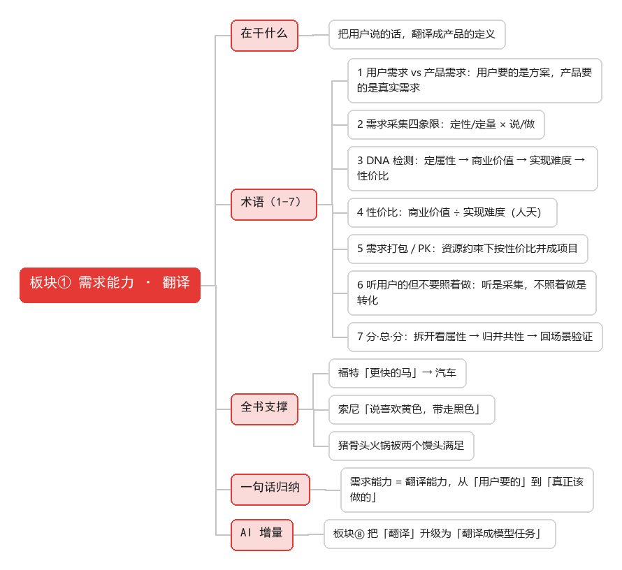

# 板块① 需求能力 · 侧重点：翻译

> 在干什么：把用户说的话，翻译成产品的定义。用户要「更快的马」，你识别出「更快到达」。

## 需求处理四步（翻译流程）

| 步 | 动作 | 关键方法 | 产出 |
|---|---|---|---|
| ① 采集 | 听用户说，把需求收集全 | 需求采集四象限（定性/定量 × 说/做） | 原始需求池 |
| ② 分析 | 拆开看本质，判断值不值得做 | DNA 检测（定属性 → 商业价值 → 实现难度 → 性价比） | 带优先级的需求清单 |
| ③ 转化 | 用户需求 → 产品需求 | 分·总·分；听用户的但不要照着做 | 产品需求定义 |
| ④ 文档化 | 把定义写成交付文档 | BRD → MRD → PRD → FSD 文档阶梯 | 可评审的 PRD |

> 四步是漏斗：采得越全、析得越透、转得越准，写出来的 PRD 越可评审。

## 术语清单

| # | 术语 | 一句话 |
|---|------|--------|
| 1 | 用户需求 vs 产品需求 | 用户要的是解决方案，产品要的是分析后的真实需求 |
| 2 | 需求采集四象限 | 定性/定量 × 说/做 |
| 3 | DNA 检测 | 定属性 → 商业价值 → 实现难度 → 性价比 |
| 4 | 性价比 | 商业价值 ÷ 实现难度（开发人天） |
| 5 | 需求打包 / PK | 资源约束下按性价比并成项目 |
| 6 | 听用户的但不要照着做 | 听是采集，不照着做是转化 |
| 7 | 分·总·分 | 拆开看属性 → 归并共性 → 回场景验证 |

## PRD 撰写步骤（文档化的终点）

> 需求能力的终点是交付一份可评审的 PRD。对应 skill `create-prd`：**4 阶段 + 14 章** B 端 PRD。

### 四阶段生成流程

| 阶段 | 做什么 | 对应章节 |
|---|---|---|
| 阶段 0 产品定型 | 判「商业属性 × 功能类型」，定各章节侧重 | — |
| 阶段 1 前置章节 | 背景 → 需求 → 商业 → 目标 → 方案 → 范围 → 风险 → 术语 | 1–9 章 |
| 阶段 2 核心功能 | 框架图 → 需求详解 → 异常处理 | 第 10 章 |
| 阶段 3 后置章节 | 埋点 → 权限 → 运营 → 待决 | 11–14 章 |
| 阶段 4 自检 | 14 维度扫描 + 待完善清单（🔴🟡🟢） | 附 |

### PRD 14 章结构

| 章 | 内容 | 章 | 内容 |
|---|---|---|---|
| 1 | 项目背景 | 8 | 术语和缩略语 |
| 2 | 需求基本情况 | 9 | 参考文献和引用文档 |
| 3 | 商业分析 | 10 | **功能需求（最核心最大）** |
| 4 | 项目收益目标 | 11 | 数据埋点 |
| 5 | 项目方案概述 | 12 | 角色和权限 |
| 6 | 项目范围 | 13 | 运营计划 |
| 7 | 项目风险 | 14 | 待决事项 |

### 输出规范要点

- **有信息则生成实质内容，信息不足标注 `[TODO]`，不编造**。
- 结构化优先：表格 / 列表 / Mermaid 优先于大段叙述。
- 图表用 Mermaid：架构图 `graph`、ER `erDiagram`、流程 `flowchart`、状态机 `stateDiagram-v2`。
- 方法论外显：关键章节用 `> 💡` 标注所用框架。
- 商业产品 vs 自研系统、0-1 vs 迭代，各章节侧重不同 → 见 [方法-PRD撰写步骤.md](方法-PRD撰写步骤.md)。

## 案例

- [案例-BRD-微信AI打车助手.md](案例-BRD-微信AI打车助手.md) — 值不值得做
- [案例-MRD-微信AI打车助手.md](案例-MRD-微信AI打车助手.md) — 给谁做
- [方法-PRD撰写步骤.md](方法-PRD撰写步骤.md) — 怎么写 PRD（14 章全流程）

## 全书支撑（《人人都是产品经理》）

- 论点：需求从用户中来，用户是需求之源，PM 的价值是把用户需求转化为产品需求。
- 例证：福特「更快的马」→ 汽车；索尼「说喜欢黄色，带走黑色」；猪骨头火锅被两个馒头满足。

## 一句话归纳

需求能力 = 翻译能力，从现象到本质，从「用户要的」到「真正该做的」。

## 面试怎么考

- 给一句模糊的用户反馈（如「用户说要黄色」），考会不会追「为什么」、会不会翻译成真实需求。
- 需求太多怎么排：现场按 DNA 检测 + 性价比给一份打包方案。
- BRD / MRD / PRD / FSD 区别：值不值 → 给谁 → 做什么 → 怎么做。

## AI 增量

板块⑧ 把「翻译」升级为「翻译成模型任务」——多一个判断维度（能不能用 AI 做）。PRD 里多问一句「模型出错了怎么办」（兜底、监控指标、人机边界）。
