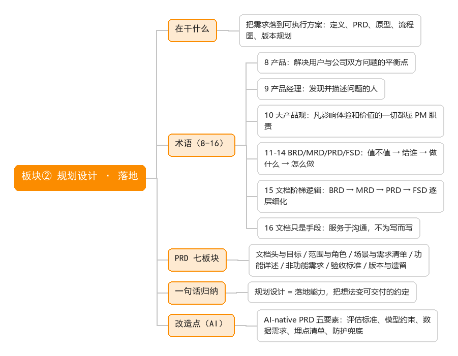

# 板块② 规划设计 · 侧重点：落地

> 在干什么：把需求落到可执行的产品方案——产品定义、PRD、原型、流程图、版本规划。

## 术语清单

| # | 术语 | 一句话 |
|---|------|--------|
| 8 | 产品 | 解决用户与公司双方问题的平衡点 |
| 9 | 产品经理 | 发现并描述问题的人，把问题转化为可交付的产品 |
| 10 | 大产品观 | 凡影响用户体验和公司价值的一切都属 PM 职责 |
| 11–14 | BRD / MRD / PRD / FSD | 值不值 → 给谁 → 做什么 → 怎么做，四层文档 |
| 15 | 文档阶梯逻辑 | BRD → MRD → PRD → FSD，逐层细化 |
| 16 | 文档只是手段 | 服务于沟通和传承，不为写而写 |

## 文档写作骨架

- **PRD 七大板块**：文档头与目标 / 范围与角色 / 场景与需求清单 / 功能详述 / 非功能需求 / 验收标准 / 版本与遗留。
- **4 条通用原则**：读者导向、结论先行、每条可验收、留痕可追溯。

## 一句话归纳

规划设计 = 落地能力，把抽象变具体，把想法变可交付的约定。

## 改造点（AI）

AI-native PRD 五要素：评估标准、模型约束、数据需求、埋点清单、防护与兜底——核心多问一句「模型出错了怎么办」。
