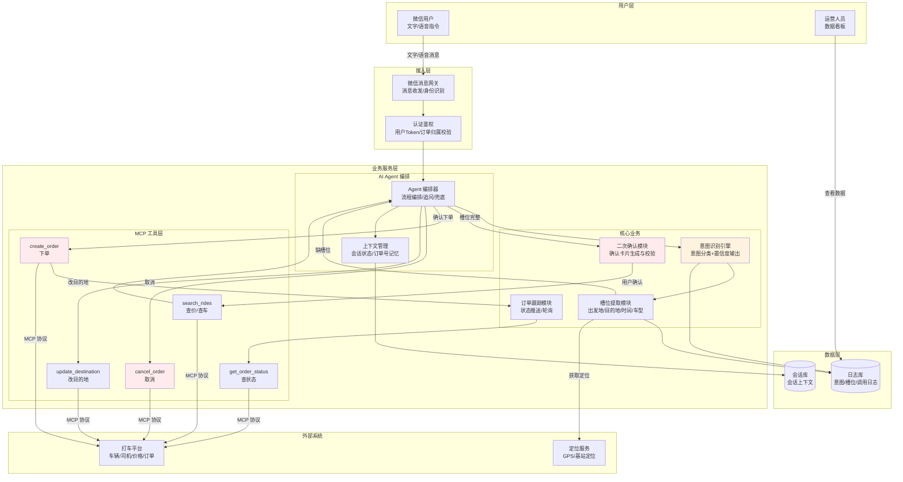
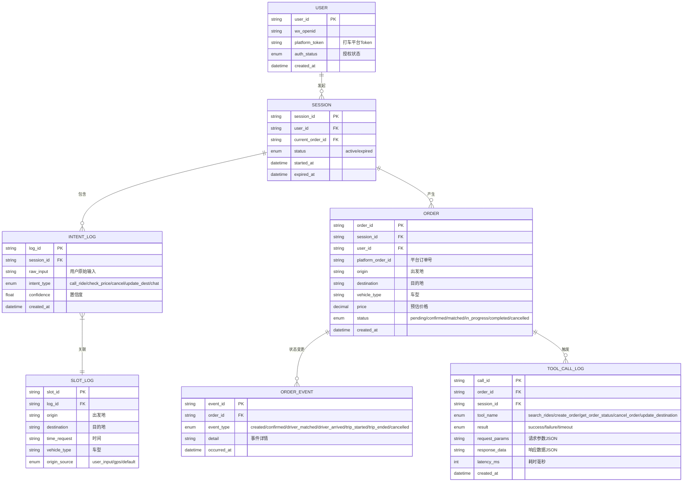
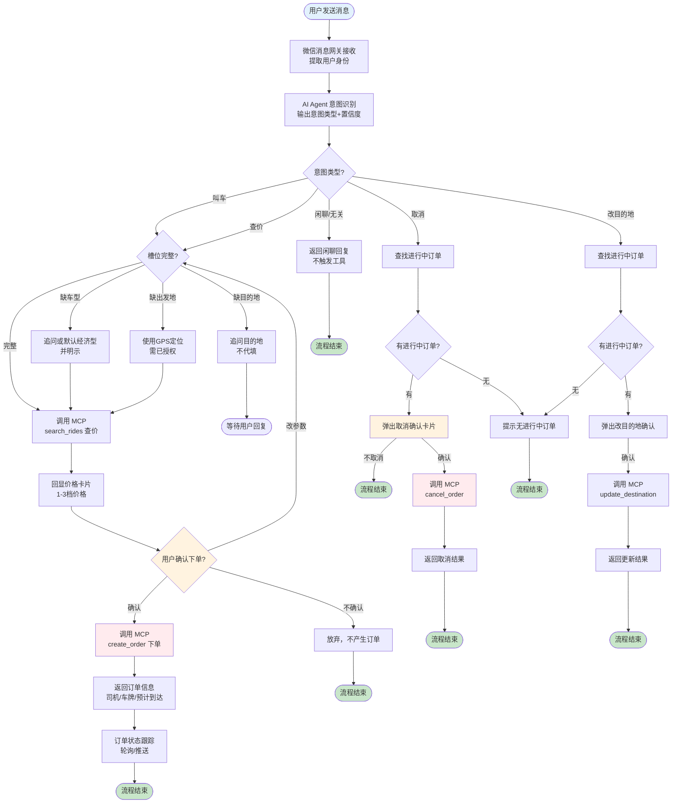
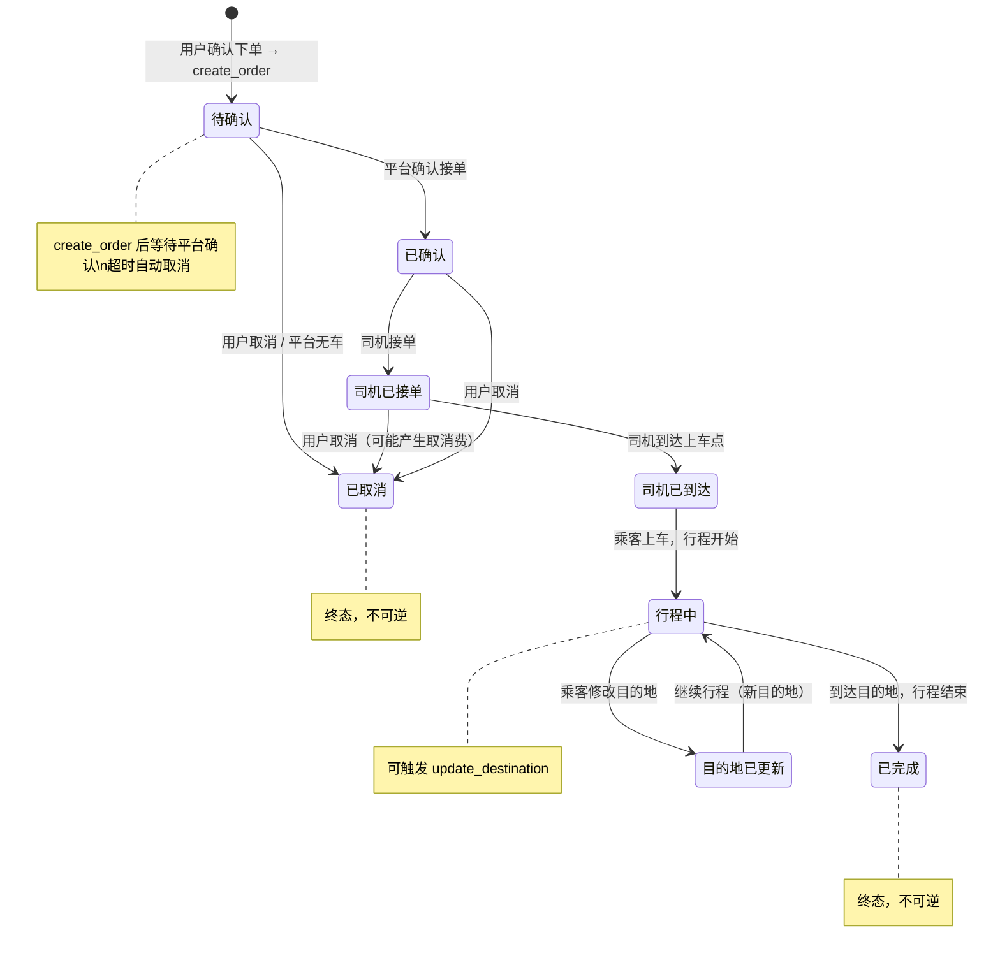

# 《微信 AI 打车助手》产品需求文档（PRD）

> 一句话：用户不用打开打车 App，在微信里说一句「帮我叫辆车去机场」，AI Agent 通过 MCP 调用打车平台完成叫车。

---

| PRD 审核人 | [TODO: 待填写] |
| --- | --- |
| 重要性 | 高 |
| 紧迫性 | 高 |
| 需求方 | 产品组 / 业务方 [TODO: 请确认具体需求提出部门] |
| PRD 编写人 | 产品组 |
| PRD 提交日期 | 2026-08-16 |

## PRD 修改记录

| 变更时间 | 变更内容 | 变更提出部门与理由 | 修改人 | 审核人 | 版本号 |
| --- | --- | --- | --- | --- | --- |
| 2026-08-15 | 初始原型版本，7章精简结构 | — | 产品组 | [TODO] | v0.1 |
| 2026-08-16 | 按14章B端PRD规范重构，补充商业分析、Mermaid图表、AI功能设计 | 产品组：规范化文档结构以支撑立项评审 | 产品组 | [TODO] | v0.2 |

---

## 1、项目背景

> 💡 方法论提示：基于《决胜B端》三层业务调研框架（战略层→战术层→执行层）

### 1.1 业务现状

网约车出行已成为城市出行的核心方式，日均订单量达数千万级（[TODO: 请补充最新行业日均订单数据]）。然而，用户的叫车行为仍然高度依赖独立 App：

- 用户需要「打开App → 输入地址 → 选择车型 → 确认下单」，操作链路长（平均 4-6 步）
- 微信作为国内最大的社交通讯平台（月活超 13 亿），用户在聊天场景中频繁产生出行需求，但当前无法直接在微信内完成叫车
- 部分平台已提供小程序入口，但仍需多步操作，未实现「对话式叫车」

### 1.2 面临问题

1. **叫车操作链路冗长**：用户从产生出行意图到完成下单平均耗时 2-3 分钟，在赶时间场景（赶高铁、赶会议）下体验极差
2. **跨应用切换成本高**：用户正在微信聊天时，需要退出微信、打开打车App、重新输入信息，上下文断裂
3. **AI 能力未被充分利用**：大语言模型已具备精准的意图理解和工具调用能力，但现有打车产品仍以传统 GUI 为主，未实现 AI-native 的交互范式
4. **MCP 协议提供了标准化接口机会**：Model Context Protocol（MCP）为 AI Agent 与外部工具之间提供了标准化的通信协议，使打车平台能力可被 AI Agent 安全、规范地调用

### 1.3 解决思路

在微信内构建 AI 打车助手，用户通过自然语言（文字/语音）下达叫车指令，由 AI Agent 完成意图理解、槽位填充、查价、下单的全流程编排，通过 MCP 协议与打车平台交互。将「打开App → 输地址 → 选车型 → 下单」压缩为「一句话」。

### 1.4 决策依据

| 决策因素 | 依据 |
| --- | --- |
| 市场需求 | 网约车日均订单 [TODO: 具体数据]，微信场景渗透率不足 [TODO: 具体数据] |
| 技术可行性 | LLM 意图识别准确率已达 95%+；MCP 协议成熟可落地 |
| 竞争窗口 | 市场尚无成熟的 AI-native 对话式叫车产品 |
| 用户调研 | [TODO: 请补充用户调研数据——多少比例用户希望"不用打开App就能叫车"] |

---

## 2、需求基本情况

> 💡 方法论提示：《决胜B端》需求发现十三要素五步法 — "分析角色"+"了解基本场景"

| 要素 | 内容 |
| --- | --- |
| **需求提出人** | 产品组 / 业务方 [TODO: 请确认具体提出部门] |
| **功能使用人** | 微信用户（有打车需求的微信活跃用户） |
| **受影响人** | 打车平台运营团队（订单来源变化）、运营团队（后台数据分析） |
| **场景描述** | 见下方核心场景 |
| **发生频率** | 预估高频：日均叫车需求 [TODO: 预估微信场景日均调用量] |
| **核心痛点** | 解决微信用户「叫车必须切App」的操作断裂问题 |
| **需求价值** | 缩短叫车链路至一句话，提升出行效率，开辟微信场景叫车新入口 |

### 核心场景描述

> 💡 场景六要素：人物、时间、地点、起因、经过、结果

**场景1：赶高铁语音叫车**
- **人物**：用户A，出差商务人士，手提行李
- **时间**：晚上 7 点，高铁发车前 1 小时
- **地点**：公司楼下，正走出办公楼
- **起因**：需要快速叫车去高铁站，手上提行李不方便操作手机
- **经过**：对微信语音说「帮我打车去高铁站，现在就走」，AI Agent 识别意图、提取槽位、查询可用车辆和价格、弹出确认卡片
- **结果（期望）**：用户点击确认，30秒内完成下单，收到司机信息推送

**场景2：下班文字叫舒适型**
- **人物**：用户B，白领，日常通勤
- **时间**：工作日 18:00，下班高峰期
- **地点**：办公室工位，微信聊天中
- **起因**：准备回家，不想挤地铁，想叫个舒适型
- **经过**：在微信对话框输入「叫个车从公司回家，舒适型」，Agent 自动获取公司定位（已授权），提取车型偏好，查价后回显
- **结果（期望）**：用户确认后下单，价格透明，不用切换到打车App

**场景3：行程中改目的地**
- **人物**：用户C，已下单乘客
- **时间**：行程中
- **地点**：车上
- **起因**：临时需要更改目的地
- **经过**：在微信中说「改目的地到国贸」，Agent 识别改单意图，调用 update_destination
- **结果（期望）**：目的地更新成功，司机端同步更新导航

**场景4：价格太贵取消订单**
- **人物**：用户D，已下单乘客
- **时间**：下单后、司机接单前
- **地点**：微信对话中
- **起因**：看到价格后觉得太贵
- **经过**：说「算了，取消吧」，Agent 识别取消意图，弹出确认卡片，用户确认后调用 cancel_order
- **结果（期望）**：订单取消成功，不产生费用

---

## 3、商业分析

> 💡 方法论提示：STP 市场细分 + 竞品分析框架（商业化产品版本）

### 3.1 目标市场与客户分析

| 分析维度 | 内容 |
| --- | --- |
| **目标市场** | 网约车出行市场，聚焦微信场景下的对话式叫车细分领域 |
| **市场规模** | TAM：中国网约车市场 [TODO: 2025/2026年市场规模数据]；SAM：微信场景叫车 [TODO: 估算]；SOM：首年目标 [TODO] |
| **市场特征** | 网约车市场高度集中（滴滴、高德等），但 AI-native 对话式交互是新兴细分赛道，尚无成熟产品 |
| **发展趋势** | AI Agent + MCP 工具调用是2025-2026年技术热点；对话式UI（CUI）正在替代部分传统GUI操作 |
| **客户画像** | 微信活跃用户，25-45岁城市白领/商务人士，有打车习惯但不愿频繁切换App，对AI交互接受度高 |
| **客户痛点** | 叫车操作步骤多、跨App切换断裂感、在聊天场景中被打断去开App的不便 |
| **卖点提炼** | 「微信里一句话，车就到了」—— 零切换、零等待、AI帮你搞定 |

### 3.2 竞品分析

| 分析维度 | 竞品A：滴滴出行（App+小程序） | 竞品B：高德打车（聚合平台） | 本产品：微信AI打车助手 |
| --- | --- | --- | --- |
| **商业模式** | 自营网约车平台 | 聚合多平台比价叫车 | AI Agent + MCP 调用打车平台 |
| **目标客户** | 全量网约车用户 | 追求性价比的聚合叫车用户 | 微信高频用户，追求极简操作 |
| **核心功能** | 完整叫车/行程/支付闭环 | 多平台比价、一键叫车 | 对话式叫车、AI意图理解、一句话下单 |
| **交互方式** | 传统GUI（表单+地图） | GUI聚合页 | 自然语言对话（CUI） |
| **核心价值** | 运力充足、品牌信任 | 比价优势、多平台聚合 | 极简交互、不切App、AI-native |
| **优势** | 运力规模、用户基础 | 价格透明、平台聚合 | 零切换成本、AI理解意图、对话式交互 |
| **劣势** | 操作链路长、需打开App | 仍需进入小程序/App | 依赖AI准确率、初期运力单一平台 |

### 3.3 差异化定位

本产品的差异化竞争策略：**「交互范式创新」而非「运力竞争」**。

- 不与滴滴/高德争运力，而是做打车平台的 AI 交互层
- 核心价值主张：将叫车从「打开App操作」变为「微信里一句话」
- 通过 MCP 协议标准化对接，理论上可接入任意打车平台，具备平台无关性
- 壁垒在于 AI 意图理解准确率 + 对话式叫车的用户体验打磨

---

## 4、项目收益目标

> 💡 方法论提示：SMART 原则（具体、可衡量、可实现、相关性、有时限）

### 4.1 项目目标

| 目标类型 | 目标描述 | 衡量指标 | 目标值 | 达成时限 |
| --- | --- | --- | --- | --- |
| **核心业务目标** | 验证微信场景对话式叫车可行性 | 日均完成订单数 | [TODO: 上线首月目标] | 上线后3个月 |
| **效率目标** | 大幅缩短叫车操作耗时 | 端到端叫车时间（意图→下单完成） | ≤ 30秒 | MVP上线时 |
| **AI准确率目标** | 意图识别达到可商用水平 | 意图识别准确率（测试集） | ≥ 95% | MVP上线前 |
| **体验目标** | 用户愿意重复使用 | 7日留存率 | [TODO] | 上线后3个月 |
| **安全目标** | 零误下单事故 | 未经确认即产生的订单数 | 0 | 持续 |

### 4.2 验收标准

**功能验收：**

| 编号 | 验收项 | 验收条件 |
| --- | --- | --- |
| AC1 | 文字指令叫车 | 用户发送「打车去XX」可正确触发叫车流程并生成订单 |
| AC2 | 意图识别 | 四类意图（叫车/查价/取消/改单）+ 闲聊识别，准确率 ≥ 95% |
| AC3 | 槽位追问 | 目的地缺失时主动追问，不代填；追问最多2轮 |
| AC4 | MCP 查价 | 正确调用 search_rides 并回显 1-3 档价格 |
| AC5 | 二次确认 | create_order / cancel_order 必须弹确认卡片，用户点确认才执行 |
| AC6 | 兜底降级 | 工具失败/模型无法解析时给出明确提示，不静默 |

**用例级验收：**

| 用例 | 前置条件 | 操作 | 预期结果 |
| --- | --- | --- | --- |
| UC1 | 已授权定位 | 语音「打车去高铁站」 | 追问车型 → 回显价格 → 确认 → 生成订单 |
| UC2 | 未说目的地 | 「帮我叫车」 | 追问目的地，不代填 |
| UC3 | 已有进行中的订单 | 「改目的地到国贸」 | 调 update_destination，回显新目的地 |
| UC4 | 已有订单 | 「取消吧」 | 弹确认卡片，确认后订单取消 |
| UC5 | 工具故障 | 正常叫车流程 | 明确失败提示，不静默不卡死 |
| UC6 | 说「随便聊聊」 | 闲聊 | 识别为闲聊，不触发任何工具调用 |

### 4.3 成功标准

> 项目上线后 3 个月内，达到以下指标视为成功：

1. 日均完成订单数 ≥ [TODO: 具体数字]
2. 意图识别准确率 ≥ 95%（离线评测集）
3. 端到端叫车时间 P95 ≤ 30 秒
4. 下单成功率（确认后） ≥ 98%
5. 事实忠实度 ≥ 99%（模型输出的金额/时间/车牌与工具返回一致）

---

## 5、项目方案概述

> 💡 方法论提示：《决胜B端》自顶向下设计 — 先全景后细节

### 5.1 核心功能概述

| 序号 | 功能模块 | 功能简述 | 优先级 |
| --- | --- | --- | --- |
| 1 | 自然语言指令入口 | 接收用户文字/语音指令，触发叫车流程 | P0 |
| 2 | 意图识别引擎 | 将自然语言映射到叫车/查价/取消/改单/闲聊五类意图 | P0 |
| 3 | 槽位提取与追问 | 提取出发地、目的地、时间、车型；缺失时主动追问 | P0 |
| 4 | MCP 工具调用层 | 封装 search_rides / create_order / get_order_status / cancel_order / update_destination 五个标准工具 | P0 |
| 5 | 二次确认卡片 | create_order / cancel_order 前弹出确认卡片，含价格/目的地回显 | P0 |
| 6 | 订单状态推送 | 司机接单/到达/上车等关键节点推送到微信 | P1 |
| 7 | 兜底降级机制 | 意图错误/工具失败/模型不可解析时的降级处理 | P0 |
| 8 | 运营数据看板 | 意图准确率、工具调用成功率、转化率等核心指标监控 | P1 |

### 5.2 方案概述

- **产品方案**：以微信对话为入口，AI Agent 做意图理解和流程编排，MCP 协议对接打车平台，实现「一句话叫车」
- **技术方案**：LLM 做意图识别 + 槽位提取（低温度、禁止幻觉），确定性逻辑做金额/状态判断；MCP Server 封装打车平台 API
- **运营方案**：先接入单一打车平台跑通链路（MVP），再逐步接入语音、多平台比价、历史订单

### 5.3 MVP 范围

> 💡 B端 MVP 原则：必须支撑核心业务流程闭环，不是"最简单的版本"

**MVP 包含的功能（v0.1）：**

| 功能 | 理由 |
| --- | --- |
| 文字指令叫车 | 核心入口，先跑通文字场景 |
| 四类意图识别（叫车/查价/取消/改单） | 覆盖主要使用场景 |
| 槽位提取与追问 | 确保信息完整，不瞎猜 |
| MCP 查价 + 下单 + 取消 + 改目的地 | 核心工具链闭环 |
| 二次确认卡片 | 安全底线，不可省略 |
| 兜底降级 | 必须有，否则体验崩塌 |
| 单平台接入 | 先跑通一个平台，降低复杂度 |

**MVP 暂不包含的功能：**

| 功能 | 延后理由 |
| --- | --- |
| 语音指令优化 | v0.2 加入，需更多嘈杂环境测试数据 |
| 多平台比价 | v0.3 加入，多平台对接复杂度高 |
| 订单实时轨迹推送 | v0.2 加入，需要平台侧实时位置数据 |
| 企业发票/报销 | v0.3 加入，需对接企业财务系统 |
| 拼车/代驾 | 非核心场景，暂不做 |
| 历史订单查询 | v0.2 加入 |

**核心验证假设：**

1. 用户愿意在微信里用自然语言叫车（而非打开App）
2. AI 意图识别准确率在实际场景中可达 95%+
3. MCP 工具调用链路稳定，端到端 ≤ 30 秒
4. 二次确认不会显著降低转化率

---

## 6、项目范围

### 6.1 涉及系统

| 系统名称 | 关系类型 | 影响描述 | 责任方 |
| --- | --- | --- | --- |
| 微信 AI 打车助手（本系统） | 主体 | 新建 | 产品团队 |
| AI Agent 服务 | 核心组件 | 新建——意图识别、槽位提取、流程编排 | AI 团队 |
| MCP Server | 核心组件 | 新建——封装打车平台 API 为 MCP 标准工具 | 后端团队 |
| 打车平台 API | 数据来源/外部依赖 | 需对接——提供车辆、价格、订单能力 | 打车平台方 |
| 微信开放平台 | 基础设施 | 已对接——消息收发、用户身份、定位授权 | 微信团队 |
| 运营数据看板 | 内部系统 | 新建——监控AI指标和业务指标 | 数据团队 |

### 6.2 影响范围

- **用户影响**：微信内有打车需求的用户将获得新的叫车入口（对话式）
- **流程影响**：叫车流程从「打开App操作」变为「微信对话」，取消/改单流程同步变化
- **数据影响**：新增意图识别日志、槽位提取日志、工具调用日志；不涉及历史数据迁移
- **上下游影响**：打车平台侧新增 MCP 渠道的订单流量；运营侧新增数据监控需求

### 6.3 不在本期范围内

| 排除项 | 排除理由 |
| --- | --- |
| 拼车功能 | 非核心场景，MVP聚焦单人叫车 |
| 代驾功能 | 独立业务线，MVP不涉及 |
| 企业发票自动报销 | 需对接企业财务系统，复杂度高，v0.3规划 |
| 多平台比价下单 | 需同时对接多个平台并处理价格口径不一致，v0.3规划 |
| 支付环节设计 | 本期复用打车平台原生支付能力，不自建支付 |
| 多语言支持 | MVP仅支持中文 |

---

## 7、项目风险

### 7.1 前提假设

| 编号 | 假设内容 | 如果假设不成立的影响 |
| --- | --- | --- |
| A1 | 打车平台提供稳定可用的 API，并愿意通过 MCP 协议对接 | 核心链路无法跑通，项目无法交付 |
| A2 | 微信开放平台允许通过对话消息触发叫车流程（不限制消息类型） | 产品形态受限，可能需改为小程序方案 |
| A3 | 用户愿意接受对话式叫车交互方式（而非坚持用App） | 产品使用率低，无法达到成功标准 |
| A4 | LLM 在真实场景中的意图识别准确率可达 95%+ | 用户体验差，频繁兜底/误操作 |
| A5 | 用户已完成微信授权和打车平台账号绑定 | 无法完成下单，需增加绑定流程 |

### 7.2 约束条件

| 编号 | 约束描述 | 对设计的影响 |
| --- | --- | --- |
| C1 | 打车平台 API 有调用频率限制（QPS） | 需设计限流和重试机制 |
| C2 | 微信消息接口有消息类型和交互能力限制 | 确认卡片的设计需在微信消息能力范围内 |
| C3 | 定位授权需用户主动同意（合规要求） | 首次使用需引导授权，增加一个步骤 |
| C4 | LLM 推理有延迟（网络+计算），P95 ≤ 2s | 影响端到端时间，需优化推理速度 |
| C5 | 本期仅接入单一打车平台 | 运力受限，高峰期可能叫不到车 |

### 7.3 风险清单

| 编号 | 风险类别 | 风险描述 | 发生概率 | 影响程度 | 应对方案 |
| --- | --- | --- | --- | --- | --- |
| R1 | 产品风险 | 用户对对话式叫车接受度低，仍习惯用App | 中 | 高 | 种子用户阶段充分验证；提供明确的引导和教程；对比App操作耗时做用户教育 |
| R2 | AI风险 | LLM 意图识别在实际场景中准确率低于预期（方言、口语、歧义） | 中 | 高 | 准备 5000+ 标注样本做评测；设计追问机制和确认卡片做二次校验；兜底转人工 |
| R3 | AI风险 | 模型幻觉——输出虚假价格/虚假司机信息 | 低 | 极高 | 严格禁止模型编造事实字段；价格/车牌等只能来自工具返回值；事实忠实度评测 ≥ 99% |
| R4 | 技术风险 | 打车平台 API 不稳定或响应超时 | 中 | 高 | 设计重试机制和超时降级；MCP Server 做熔断保护；超时明确告知用户 |
| R5 | 技术风险 | 用户无打车平台账号，绑定链路未打通 | 中 | 中 | 提前与平台方确认微信授权 → 平台 token 的绑定方案；MVP阶段可要求用户先注册 |
| R6 | 合规风险 | 定位数据采集和网约车信息留存的合规要求 | 低 | 高 | 定位授权明示同意；通话/支付留痕可审计；符合网约车信息留存法规 |
| R7 | 运营风险 | 嘈杂环境下语音识别率低 | 中 | 中 | v0.1仅支持文字；v0.2再做语音优化，积累真实环境数据 |
| R8 | 安全风险 | Agent 被恶意利用（刷单、越权下单） | 低 | 高 | create_order 强制二次确认；下单鉴权绑定用户身份；订单归属校验；限流防刷 |

---

## 8、术语和缩略语

| 术语/缩略语 | 全称 | 定义说明 |
| --- | --- | --- |
| MCP | Model Context Protocol | AI Agent 与外部工具之间的标准化通信协议，定义工具描述、调用和返回的规范 |
| Agent | AI Agent | 具备意图理解、流程编排、工具调用能力的智能体 |
| 槽位 | Slot | 意图识别中需要提取的关键参数（如出发地、目的地、时间、车型） |
| 意图 | Intent | 用户指令的目的分类（叫车、查价、取消、改单、闲聊） |
| 事实忠实度 | Factual Faithfulness | 模型输出中的事实字段（金额、时间、车牌等）与工具返回值的一致性 |
| CUI | Conversational User Interface | 对话式用户界面，区别于传统GUI |
| LLM | Large Language Model | 大语言模型，本系统中用于意图识别和槽位提取 |
| FSD | Functional Specification Document | 功能规格说明书，PRD的后续文档 |
| BRD | Business Requirement Document | 业务需求文档，PRD的前置文档 |
| MRD | Market Requirement Document | 市场需求文档，PRD的前置文档 |

## 9、参考文献和引用文档

| 文档名称 | 版本 | 链接/位置 | 说明 |
| --- | --- | --- | --- |
| BRD：微信场景叫车渗透率分析 | v0.1 | `product/01-需求能力/案例-BRD-微信AI打车助手.md` | 业务价值论证（值不值得做） |
| MRD：微信AI打车助手目标用户分析 | v0.1 | `product/01-需求能力/案例-MRD-微信AI打车助手.md` | 目标用户画像（给谁做） |
| MCP 协议规范 | [TODO] | [TODO: 官方文档链接] | MCP Server 实现依据 |
| 打车平台 API 文档 | [TODO] | [TODO: 平台方提供] | MCP Server 封装依据 |
| FSD：微信AI打车助手功能规格 | v0.1 | `product/02-规划设计/案例-FSD-微信AI打车助手.md` | Agent编排+MCP接口+数据模型+部署方案 |

---

## 10、功能需求

> 💡 方法论基础：《决胜B端》自顶向下设计（框架图→数据模型→流程→页面→权限→字段）

### 10.1 产品框架概述

#### 10.1.1 应用架构图

**架构层次说明：**

| 层次 | 核心组件 | 职责 |
| --- | --- | --- |
| 用户层 | 微信用户、运营人员 | 发起指令 / 查看数据 |
| 接入层 | 微信消息网关、认证鉴权 | 消息收发、身份验证、权限校验 |
| 业务服务层 | Agent编排器、意图识别、槽位提取、二次确认、订单跟踪、MCP工具 | 核心业务逻辑编排 |
| 数据层 | 日志库、会话库 | 存储AI调用日志和会话上下文 |
| 外部系统 | 打车平台、定位服务 | 提供运力、价格、订单和定位能力 |

#### 10.1.2 数据模型图

> 💡 ER 建模三步法：找实体 → 梳理关系 → 确定属性

**实体说明：**

| 实体 | 说明 | 核心业务规则 |
| --- | --- | --- |
| USER | 用户信息，含微信身份和打车平台绑定 | platform_token 为空时无法下单 |
| SESSION | 一次对话会话，携带上下文 | 跨天自动过期，不继承前一天的订单号（防串单） |
| INTENT_LOG | 每次意图识别的日志 | 置信度低于阈值时走兜底追问 |
| SLOT_LOG | 槽位提取结果 | 目的地不可代填，出发地可用定位 |
| ORDER | 订单核心实体 | 同一会话未完结订单不重复创建（幂等） |
| ORDER_EVENT | 订单状态变更事件 | 记录每次状态变更用于推送和审计 |
| TOOL_CALL_LOG | MCP工具调用日志 | 记录每次调用的请求/响应/耗时/成败 |

#### 10.1.3 核心业务流程图

#### 10.1.4 订单状态机图

**状态转换明细表：**

| 当前状态 | 触发事件 | 目标状态 | 操作角色 | 备注 |
| --- | --- | --- | --- | --- |
| — | 用户确认下单，create_order 成功 | 待确认 | 用户（确认后）→ Agent | 需二次确认后才可触发 |
| 待确认 | 平台确认 | 已确认 | 系统（平台回调） | 超时未确认自动取消 |
| 待确认 | 用户取消 / 平台无车 | 已取消 | 用户 / 系统 | 无取消费 |
| 已确认 | 司机接单 | 司机已接单 | 系统（平台回调） | 推送司机信息 |
| 司机已接单 | 司机到达上车点 | 司机已到达 | 系统（平台回调） | 推送到达通知 |
| 司机已到达 | 乘客上车，行程开始 | 行程中 | 系统（平台回调） | 推送到达通知 |
| 行程中 | 到达目的地 | 已完成 | 系统（平台回调） | 推送行程结束 |
| 行程中 | 乘客改目的地 | 目的地已更新 | 用户 → Agent | 需调用 update_destination |
| 目的地已更新 | 继续行程 | 行程中 | 系统 | 自动回转为行程中 |
| 司机已接单 | 用户取消 | 已取消 | 用户（确认后）→ Agent | 可能产生取消费用 |
| 已确认 | 用户取消 | 已取消 | 用户（确认后）→ Agent | 无取消费 |

#### 10.1.5 功能清单

| 子系统 | 功能 | 微信端 | 运营后台 | 说明 |
| --- | --- | --- | --- | --- |
| 指令入口 | 文字消息接收 | ✓ | — | 核心入口 |
| 指令入口 | 语音消息接收 | — (v0.2) | — | v0.1仅文字 |
| 意图识别 | 五类意图分类 | ✓ | — | 叫车/查价/取消/改单/闲聊 |
| 意图识别 | 置信度评估 | ✓ | — | 低于阈值走兜底 |
| 槽位管理 | 出发地/目的地/时间/车型提取 | ✓ | — | |
| 槽位管理 | 缺失槽位追问 | ✓ | — | 最多2轮追问 |
| MCP工具 | search_rides 查价 | ✓ | — | 返回1-3档价格 |
| MCP工具 | create_order 下单 | ✓ | — | 需二次确认 |
| MCP工具 | get_order_status 查状态 | ✓ | — | 轮询/推送 |
| MCP工具 | cancel_order 取消 | ✓ | — | 需二次确认 |
| MCP工具 | update_destination 改目的地 | ✓ | — | 需确认 |
| 二次确认 | 下单确认卡片 | ✓ | — | 含价格/目的地回显 |
| 二次确认 | 取消确认卡片 | ✓ | — | 回显订单信息 |
| 订单推送 | 司机接单/到达/上车通知 | ✓ | — | P1 |
| 兜底降级 | 工具失败提示 | ✓ | — | 明确错误提示 |
| 兜底降级 | 模型不可解析降级 | ✓ | — | 引导用户用App |
| 运营看板 | AI指标监控 | — | ✓ | 意图准确率/槽位F1等 |
| 运营看板 | 业务指标监控 | — | ✓ | 转化率/完成率等 |

---

### 10.2 产品需求详解

#### 10.2.1 意图识别与槽位提取 功能详解

##### 10.2.1.1 业务流程

1. 微信消息网关接收用户消息（文字），传递用户身份和消息内容
2. Agent 编排器将消息送入意图识别引擎
3. 意图识别引擎输出意图类型（叫车/查价/取消/改单/闲聊）和置信度
4. 若为叫车/查价意图，进入槽位提取模块
5. 槽位提取模块从用户消息中抽取出发地、目的地、时间、车型
6. 缺失槽位时，Agent 生成追问消息（最多2轮），等待用户补充
7. 槽位完整后，进入 MCP 工具调用流程

##### 10.2.1.2 页面交互

**对话交互界面（微信对话窗口）：**

> 💡 设计原则：有用 > 高效 > 容错 > 启发

**追问场景：**

| 缺失槽位 | 追问话术 | 用户可输入示例 |
| --- | --- | --- |
| 目的地 | 「请问您要去哪里？」 | 「去国贸」「三里屯」 |
| 车型（可选） | 「需要哪种车型？经济型/舒适型/商务型，不选默认经济型」 | 「舒适型」「随便」 |
| 时间（模糊） | 「您说的「一会儿」大概是几点出发？现在出发也可以」 | 「现在」「半小时后」 |
| 出发地（未授权定位） | 「需要获取您的位置来叫车，请授权定位，或者直接告诉我出发地」 | 「国贸」「授权」 |

**操作按钮（确认卡片）：**

| 按钮名称 | 操作说明 | 触发条件 | 权限要求 |
| --- | --- | --- | --- |
| 确认下单 | 触发 create_order | 用户点击确认卡片「确认」按钮 | 已登录用户 |
| 修改 | 重新进入槽位编辑 | 用户点击确认卡片「修改」按钮 | 已登录用户 |
| 放弃 | 取消本次叫车 | 用户点击确认卡片「取消」按钮 | 已登录用户 |

##### 10.2.1.3 业务规则

| 编号 | 规则类型 | 规则描述 |
| --- | --- | --- |
| R1 | 约束 | 目的地缺失时**禁止**代填，必须追问用户 |
| R2 | 约束 | 追问最多 2 轮，超过 2 轮仍不完整则走兜底提示用户自行操作 |
| R3 | 约束 | 出发地缺省 = 用户当前定位（需已授权），未授权时提示授权 |
| R4 | 推论 | 时间模糊词（「一会儿」「等下」）默认解析为「现在出发」，并在回复中明示 |
| R5 | 推论 | 车型未指定时默认「经济型」，并在回复中明示 |
| R6 | 触发条件 | 意图置信度 < 阈值（[TODO: 具体阈值]）时，不执行操作，走兜底追问 |
| R7 | 约束 | 「闲聊」意图不触发任何 MCP 工具调用 |

##### AI 功能设计

> 💡 确定性-容错性四象限分析 + 六脉神剑交互模式选择

**任务特征分析：**

| 分析维度 | 评估 |
| --- | --- |
| 确定性 | **高**（目标明确：叫车/查价/取消/改单，五分类） |
| 容错性 | **低**（意图识别错可能导致误下单/误取消，有资金后果） |
| 推荐交互模式 | **CUI 嵌入 GUI**：对话式交互 + 结构化确认卡片 |

**AI 交互设计：**
- **交互模式**：CUI 嵌入 GUI — 对话式理解意图，但关键操作（下单/取消）通过结构化确认卡片（GUI元素）让用户确认
- **人机边界**：AI 负责意图识别和槽位提取；用户必须确认下单/取消操作；AI 无权替用户做决策
- **降级方案**：意图识别连续 2 轮置信度低于阈值 → 提示用户「暂时无法理解，建议打开打车App操作」
- **监控指标**：意图识别准确率、槽位提取 F1、追问率、兜底转人工率

**模型约束：**
- **温度**：意图识别和槽位提取使用低温度（≤ 0.3），减少随机性
- **幻觉防护**：禁止模型编造价格、车牌、司机信息等事实字段
- **上下文管理**：单次会话上下文保留当前订单号；跨天会话自动过期，不继承前一天的订单（防串单）

---

#### 10.2.2 MCP 工具调用层 功能详解

##### 10.2.2.1 业务流程

1. Agent 编排器根据意图和槽位，选择对应的 MCP 工具
2. 构造工具调用参数（出发地、目的地、时间、车型、用户Token等）
3. 对于 create_order / cancel_order，先弹出确认卡片
4. 用户确认后，执行 MCP 工具调用
5. 接收工具返回结果，格式化后回复用户

##### MCP 工具清单

| 工具名称 | 功能 | 输入参数 | 输出 | 需确认 |
| --- | --- | --- | --- | --- |
| `search_rides` | 查价/查可用车辆 | origin, destination, time, vehicle_type | 价格列表、预计时长、可用车辆数 | 否 |
| `create_order` | 下单 | origin, destination, vehicle_type, user_token | 订单号、司机信息、预计到达时间 | **是** |
| `get_order_status` | 查询订单状态 | order_id | 状态枚举（待确认/已接单/已到达/行程中/已完成/已取消） | 否 |
| `cancel_order` | 取消订单 | order_id, reason | 是否成功、取消费用（如有） | **是** |
| `update_destination` | 修改目的地 | order_id, new_destination | 是否成功、新预估价格 | 是 |

##### 10.2.2.2 页面交互

**价格回显卡片：**

| 字段名称 | 字段类型 | 备注 |
| --- | --- | --- |
| 出发地 | 文本 | 自动填充（GPS或用户输入） |
| 目的地 | 文本 | 用户输入 |
| 经济型价格 | 金额 | 如 ¥25-30 |
| 舒适型价格 | 金额 | 如 ¥35-42 |
| 商务型价格 | 金额 | 如 ¥55-65（如有） |
| 预计时长 | 文本 | 如「约25分钟」 |
| 「确认下单」按钮 | 操作 | 触发 create_order |
| 「修改」按钮 | 操作 | 重新编辑槽位 |

**下单确认卡片：**

| 字段名称 | 字段类型 | 备注 |
| --- | --- | --- |
| 出发地 | 文本 | 完整地址回显 |
| 目的地 | 文本 | 完整地址回显 |
| 车型 | 文本 | 用户选择的车型 |
| 预估价格 | 金额 | 精确价格 |
| 「确认下单」按钮 | 操作 | **真正触发 create_order** |
| 「修改」按钮 | 操作 | 回退编辑槽位 |
| 「放弃」按钮 | 操作 | 取消本次操作 |

**取消确认卡片：**

| 字段名称 | 字段类型 | 备注 |
| --- | --- | --- |
| 订单号 | 文本 | 回显当前订单号 |
| 出发地 → 目的地 | 文本 | 回显行程信息 |
| 当前状态 | 文本 | 如「司机已接单」 |
| 取消费用 | 金额 | 如有取消费用需明示 |
| 「确认取消」按钮 | 操作 | 触发 cancel_order |
| 「不取消」按钮 | 操作 | 放弃取消操作 |

##### 10.2.2.3 业务规则

| 编号 | 规则类型 | 规则描述 |
| --- | --- | --- |
| R8 | 约束 | `create_order` 和 `cancel_order` **必须**经过二次确认，Agent 无权限跳过 |
| R9 | 约束 | 同一会话中未完结订单不允许重复 `create_order`（幂等保护） |
| R10 | 约束 | `cancel_order` 和 `update_destination` 需校验订单归属（order.user_id = 当前用户） |
| R11 | 计算 | 价格展示直接取自 MCP 工具返回值，Agent 不做二次计算 |
| R12 | 触发条件 | MCP 工具调用超时（> 3s）→ 重试 1 次，仍失败则返回「暂时无法完成，请稍后再试」 |
| R13 | 约束 | 工具调用失败时，向用户展示明确的失败原因，**不静默忽略** |
| R14 | 约束 | 下单鉴权必须绑定用户身份（user_token），禁止匿名下单 |

---

#### 10.2.3 订单状态推送 功能详解

##### 10.2.3.1 业务流程

1. 下单成功后，Agent 启动订单跟踪（轮询 get_order_status 或接收平台回调）
2. 状态变更时，生成推送消息发送到微信对话
3. 推送节点：司机已接单（含司机信息）→ 司机已到达 → 行程开始 → 行程结束

##### 10.2.3.2 推送消息

| 状态变更 | 推送内容 | 是否推送 |
| --- | --- | --- |
| 司机已接单 | 「司机张师傅（京A·12345）已接单，预计5分钟到达」 | ✓ |
| 司机已到达 | 「司机已到达上车点，请前往上车」 | ✓ |
| 行程开始 | 「行程已开始，目的地：XX」 | ✓ |
| 行程结束 | 「行程已结束，费用 ¥XX，请在打车平台App中完成支付」 | ✓ |

##### 10.2.3.3 业务规则

| 编号 | 规则类型 | 规则描述 |
| --- | --- | --- |
| R15 | 触发条件 | 订单状态每 10 秒轮询一次，或接收平台 webhook 回调 |
| R16 | 约束 | 会话过期后不再推送（避免骚扰） |
| R17 | 事实 | 支付环节由打车平台原生支付完成，本系统不介入支付 |

---

#### 10.2.4 兜底降级机制 功能详解

##### 10.2.4.1 业务流程

当系统出现异常时，按以下优先级降级：
1. 意图识别置信度低于阈值 → 追问用户
2. 追问 2 轮仍无法理解 → 提示「抱歉，暂时无法理解您的意思，建议打开打车App操作」
3. MCP 工具调用失败 → 明确提示「叫车服务暂时不可用，请稍后再试」
4. 模型输出无法解析 → 走规则兜底 + 转人工引导

##### 10.2.4.2 降级策略

| 异常情形 | 降级策略 | 用户侧表现 |
| --- | --- | --- |
| 意图识别错误 | 确认卡片回显操作详情，用户可见可改 | 看到确认卡片上写的是错的，可以点「修改」 |
| 槽位填错目的地 | 确认卡片回显完整起终点 | 用户看到目的地不对，可修改 |
| 工具调用失败/超时 | 明确错误提示 + 记录失败日志 | 「暂时叫不到车，请稍后再试」 |
| 模型输出不可解析 | 规则兜底 + 引导用户用App | 「抱歉出了点问题，建议您直接打开打车App叫车」 |
| 重复下单/重复扣费 | 幂等保护：同一会话未完结订单不重复 create_order | 不会产生重复订单 |
| 越权操作 | create_order 强制二次确认，无「自动下单」开关 | Agent 不可能替用户直接下单 |

---

### 10.3 异常情况处理方案

| 异常类型 | 异常场景 | 处理方案 |
| --- | --- | --- |
| **网络异常** | 用户发消息时断网 / MCP调用中断网 | 客户端微信自动重试；服务端MCP调用超时后重试1次，仍失败返回明确提示 |
| **并发冲突** | 用户连续发送多条叫车指令 | 会话锁：同一会话同一时间只处理一个未完成流程，后续消息排队或提示「正在处理上一条请求」 |
| **数据异常** | 打车平台返回异常数据（价格为负/空车牌） | 服务端校验拦截：价格 ≤ 0 不展示，异常数据记日志并返回「数据异常，请稍后再试」 |
| **误操作** | 用户误点「确认下单」 | 下单后立即可取消（司机接单前免费取消）；确认卡片设计醒目的「修改」按钮降低误操作概率 |
| **业务异常** | 无可用车辆 / 平台限流 / 高峰期排队 | 明确告知「当前无可用车辆」或「排队中，预计等待X分钟」；提供取消选项 |
| **AI模型异常** | LLM 服务不可用 / 响应超时 | 降级到规则引擎：关键词匹配兜底（如「取消」→取消流程）；仍无法处理则引导用户用App |
| **账号异常** | 用户未绑定打车平台账号 | 下单前检测 platform_token，为空时引导用户完成账号绑定 |
| **安全异常** | 疑似刷单/恶意调用 | 限流保护：单用户每分钟最多 5 次工具调用；异常频率触发风控告警 |

---

## 11、数据埋点

> 💡 方法论提示：B端重点在功能采纳率和业务流程效率；AI产品需额外监控模型质量

### 11.1 埋点策略

- **埋点目标**：监控 AI 模型质量、叫车转化漏斗、用户行为路径、系统稳定性
- **埋点工具**：[TODO: 请确认公司统一的埋点工具]

### 11.2 页面埋点

| 页面/场景 | 事件名称 | 事件类型 | 采集参数 | 用途说明 |
| --- | --- | --- | --- | --- |
| 对话窗口激活 | chat_session_start | 页面曝光 | user_id, source | 监控入口使用量 |
| 价格回显卡片 | price_card_view | 页面曝光 | session_id, vehicle_types | 监控查价到达率 |
| 下单确认卡片 | confirm_card_view | 页面曝光 | session_id, price | 监控下单转化率前置指标 |
| 取消确认卡片 | cancel_card_view | 页面曝光 | session_id, order_id | 监控取消操作量 |

### 11.3 行为埋点

| 操作名称 | 事件名称 | 触发条件 | 采集参数 | 用途说明 |
| --- | --- | --- | --- | --- |
| 用户发送叫车指令 | intent_call_ride | 消息发送 | user_id, input_text, intent_confidence | 核心入口监控 |
| 用户确认下单 | order_confirmed | 点击确认按钮 | order_id, price, time_to_confirm | 下单转化率 |
| 用户点击修改 | order_modified | 点击修改按钮 | session_id, modified_field | 了解用户修改偏好 |
| 用户放弃下单 | order_abandoned | 点击放弃/超时 | session_id, abandon_reason | 分析流失原因 |
| 用户确认取消 | cancel_confirmed | 点击确认取消 | order_id, cancel_reason | 取消率分析 |
| 用户追问补充槽位 | slot_supplement | 用户回复追问 | slot_type, round_number | 追问效率分析 |

### 11.4 业务指标埋点

| 指标名称 | 计算方式 | 数据来源 | 统计周期 |
| --- | --- | --- | --- |
| 日活叫车用户数 | count(distinct user_id where intent=call_ride) | 意图日志 | 日 |
| 叫车转化率 | count(order_confirmed) / count(intent_call_ride) | 行为日志 | 日 |
| 下单成功率 | count(create_order success) / count(order_confirmed) | 工具调用日志 | 日 |
| 端到端叫车时间 | P95(timestamp(order_confirmed) - timestamp(intent_call_ride)) | 行为日志 | 日 |
| 取消率 | count(cancel_confirmed) / count(order_confirmed) | 行为日志 | 日 |
| 一次说清率 | count(无需追问直接完整) / count(intent_call_ride) | 槽位日志 | 日 |

### 11.5 AI 专项监控指标

| 指标名称 | 计算方式 | 数据来源 | 告警阈值 |
| --- | --- | --- | --- |
| 意图识别准确率 | 离线评测集准确率 | 标注数据 | < 93% 告警 |
| 意图识别 top1 置信度分布 | 按置信度区间统计 | 意图日志 | 低置信度占比 > 20% 告警 |
| 槽位提取 F1 | 离线评测 F1 score | 标注数据 | < 88% 告警 |
| 槽位缺失类型分布 | 按缺失槽位分组统计 | 槽位日志 | — |
| 事实忠实度 | 模型输出 vs 工具返回逐字段比对 | 工具调用日志+模型输出 | < 99% 告警 |
| MCP 工具调用成功率 | count(success) / count(total) | 工具调用日志 | < 95% 告警 |
| MCP 工具调用 P95 延迟 | P95(latency_ms) | 工具调用日志 | > 3000ms 告警 |
| 兜底转人工率 | count(fallback_to_manual) / count(total) | 兜底日志 | > 5% 告警 |
| 用户纠正次数 | count(user_correction) | 纠正日志 | 持续上升告警 |
| 追问轮次分布 | 按追问轮次统计 | 槽位日志 | — |

---

## 12、角色和权限

> 💡 方法论提示：工具型产品采用简化角色设计，重点在功能权限而非复杂 RBAC

### 12.1 角色定义

| 角色名称 | 角色说明 | 权限范围 |
| --- | --- | --- |
| 微信用户 | 通过微信对话使用打车助手 | 叫车、查价、取消、改目的地、查看订单状态 |
| 管理员 | 运营数据看板用户、系统配置 | 查看AI指标、业务指标、日志审计、系统参数配置 |
| API（MCP Server） | 打车平台工具接口 | 提供标准MCP工具能力（search_rides等），受调用频率限制 |

### 12.2 功能权限差异

| 功能 | 微信用户 | 管理员 |
| --- | --- | --- |
| 文字指令叫车 | ✓ | — |
| 查价 | ✓ | — |
| 下单（需确认） | ✓ | — |
| 取消订单（需确认） | ✓ | — |
| 改目的地 | ✓ | — |
| 查看订单状态 | ✓ | — |
| AI 指标监控看板 | — | ✓ |
| 业务指标监控看板 | — | ✓ |
| 调用日志审计 | — | ✓ |
| 系统参数配置（阈值/模型版本） | — | ✓ |

### 12.3 API 权限控制

| API 分组 | 权限级别 | 限流规则 | 说明 |
| --- | --- | --- | --- |
| search_rides | 基础权限 | 单用户 10 次/分钟 | 查价频率限制 |
| create_order | 高级权限 | 单用户 5 次/分钟 | 下单频率限制，防刷单 |
| cancel_order | 高级权限 | 单用户 5 次/分钟 | 取消频率限制 |
| update_destination | 高级权限 | 单用户 3 次/分钟 | 改目的地频率限制 |
| get_order_status | 基础权限 | 单用户 20 次/分钟 | 查状态频率限制 |

### 12.4 安全约束

| 约束项 | 说明 |
| --- | --- |
| 下单鉴权 | create_order 必须携带用户有效 Token，绑定用户身份 |
| 订单归属校验 | cancel_order / update_destination 校验 order.user_id = 当前用户 |
| 接口传输 | 全量 HTTPS |
| 会话隔离 | 用户只能查看/操作自己的订单 |
| 定位授权 | 获取用户GPS定位前必须获得明示同意 |

---

## 13、运营计划

> 💡 方法论提示：商业化产品运营漏斗 — 获客→激活→留存→续费→扩展

### 13.1 上线发布计划

| 阶段 | 时间 | 范围 | 目标 | 回滚方案 |
| --- | --- | --- | --- | --- |
| 内测 | [TODO] | 内部团队（20人） | 基础功能验证、AI准确率验证 | 关闭入口 |
| 种子用户 | [TODO] | 100-200名种子用户 | 核心流程验证、收集真实场景数据 | 关闭入口，引导回App |
| 灰度发布 | [TODO] | 部分微信用户（1000-5000人） | 性能和体验验证、AI指标达标确认 | 降级为纯文字引导 |
| 正式发布 | [TODO] | 全量开放 | 规模化运营 | [TODO] |

### 13.2 种子用户策略

- **目标种子用户画像**：25-40岁城市白领/商务人士，微信日活用户，有打车习惯，对AI交互接受度高
- **种子用户数量**：100-200人
- **合作方式**：首批打车优惠券（[TODO: 具体金额]）+ 优先体验新功能
- **核心验证点**：
  1. 用户是否愿意在微信中用对话方式叫车
  2. 真实场景下意图识别准确率是否达标
  3. 二次确认是否显著影响转化率

### 13.3 数据闭环与 AI 迭代

| 环节 | 描述 | 频率 |
| --- | --- | --- |
| 数据采集 | 意图日志、槽位日志、工具调用日志、用户纠正数据 | 实时 |
| 负样本回流 | 兜底转人工/用户纠正/低置信度样本标记为负样本 | 日 |
| 模型评测 | 在离线评测集上跑意图准确率、槽位F1、事实忠实度 | 周 |
| 模型迭代 | 基于负样本和新数据微调模型 | 月 |
| 训练数据扩充 | 标注样本从 5000 → [TODO: 目标数量]，覆盖方言、口语 | 季度 |

### 13.4 需求收集与迭代

- **需求收集渠道**：用户对话中的反馈消息、种子用户群聊、运营数据异常分析
- **迭代节奏**：双周小版本（模型迭代/规则优化）、月度中版本（新功能）、季度大版本（新平台接入）

### 13.5 版本演进路线

| 版本 | 核心功能 | 预计时间 |
| --- | --- | --- |
| v0.1（MVP） | 单平台、文字指令、四意图、二次确认、兜底降级 | [TODO] |
| v0.2 | 语音优化、多车型比价、订单实时轨迹推送、历史订单 | [TODO] |
| v0.3 | 多平台接入、企业发票、智能推荐车型 | [TODO] |

---

## 14、待决事项

| 编号 | 待决事项 | 涉及章节 | 负责人 | 预计决策时间 | 当前状态 |
| --- | --- | --- | --- | --- | --- |
| TBD-1 | 意图识别置信度阈值的具体数值（兜底触发线） | 10.2.1 | [TODO] | [TODO] | 待讨论 |
| TBD-2 | 打车平台账号绑定链路方案（微信授权→平台Token） | 7 / 10.2.2 | [TODO] | [TODO] | 待与平台方确认 |
| TBD-3 | 微信消息接口是否支持所需的卡片交互类型 | 6 / 10.2.2 | [TODO] | [TODO] | 待技术验证 |
| TBD-4 | MCP Server 的部署架构和技术选型 | 10.1.1 | [TODO] | [TODO] | 待技术方案评审 |
| TBD-5 | 种子用户打车优惠券预算 | 13.2 | [TODO] | [TODO] | 待审批 |
| TBD-6 | 多平台比价时价格口径不一致的处理规则 | 5.3（v0.3） | [TODO] | [TODO] | 待讨论 |
| TBD-7 | 嘈杂环境语音识别率是否在v0.2前达标 | 7（R7） | [TODO] | [TODO] | 待数据验证 |
| TBD-8 | 运营数据看板的具体技术选型和实现方 | 6.1 | [TODO] | [TODO] | 待确认 |
| TBD-9 | 上线各阶段的具体时间节点 | 13.1 | [TODO] | [TODO] | 待排期 |
| TBD-10 | 标注样本目标数量（5000+的基础上扩展目标） | 13.3 | [TODO] | [TODO] | 待讨论 |

> ⚠️ 当前待决事项恰好 10 项，处于可控范围。建议在立项评审前优先解决 TBD-1（置信度阈值）和 TBD-2（账号绑定方案），这两项直接影响核心链路能否跑通。

---

## 附：待完善清单

### 🔴 必须补充（影响PRD可评审性）

1. **打车平台账号绑定链路方案（TBD-2）**：用户无打车平台账号时如何绑定（微信授权→平台Token），直接影响核心链路是否能跑通。建议提前与打车平台方对齐技术方案。
2. **意图识别置信度阈值（TBD-1）**：兜底降级的触发线，直接影响用户体验和AI准确率表现。建议基于离线评测集的置信度分布数据确定。
3. **市场规模数据（第3章）**：TAM/SAM/SOM 的具体数字，支撑商业价值论证。建议参考易观、艾瑞等机构的网约车市场报告。
4. **上线时间节点（TBD-9）**：各阶段发布的具体时间，是项目计划的基础。建议与技术团队排期后确认。

### 🟡 建议补充（提升PRD质量）

1. **微信消息接口的卡片交互能力验证（TBD-3）**：确认微信开放平台是否支持所需的确认卡片交互类型，影响产品设计形态。建议尽早做技术 PoC。
2. **种子用户优惠券预算（TBD-5）**：种子用户激励的具体金额和方式，影响种子用户阶段的执行。
3. **用户调研数据（第1章）**：多少比例用户希望「不用打开App就能叫车」，补充决策依据的说服力。
4. **模型版本和选型细节（第10章）**：使用哪个LLM、模型版本、推理部署方式（云端/边缘），影响性能和成本。

### 🟢 可选完善（锦上添花）

1. **竞品市场份额数据（第3章）**：各竞品的具体市场份额，增强竞品分析深度。
2. **多平台比价口径的处理规则（TBD-6）**：v0.3 的提前规划，当前不急。
3. **标注样本扩展目标（TBD-10）**：从 5000 扩展到多少，基于模型迭代效果决定。

---
> 💡 建议：优先补充 🔴 类内容后，可使用 `/check-prd` 对完善后的 PRD 进行完整评审。
