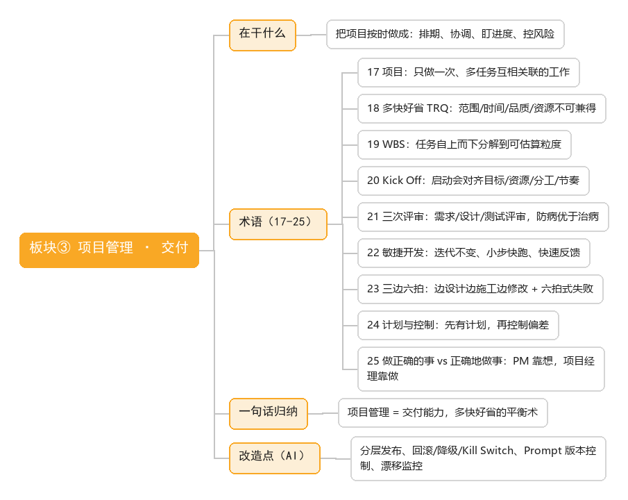

# 板块③ 项目管理 · 侧重点：交付

> 在干什么：把项目按时做成——排期、协调、盯进度、控风险、保交付。

## 术语清单

| # | 术语 | 一句话 |
|---|------|--------|
| 17 | 项目 | 只做一次、包含多项互相关联任务的工作 |
| 18 | 多快好省（TRQ） | 范围/时间/品质/资源四者不可兼得 |
| 19 | WBS | 任务自上而下分解到可分配可估算的粒度 |
| 20 | Kick Off | 项目启动会，对齐目标/资源/分工/节奏 |
| 21 | 三次评审 | 需求/设计/测试评审，防病优于治病 |
| 22 | 敏捷开发 | 迭代范围不变、小步快跑、快速反馈 |
| 23 | 三边六拍 | 边设计边施工边修改，六拍式失败模式 |
| 24 | 计划与控制 | 先有计划，再按计划控制偏差 |
| 25 | 做正确的事 vs 正确地做事 | PM 靠想定方向，项目经理靠做保执行 |

## 一句话归纳

项目管理 = 交付能力，多快好省的平衡术，把承诺变成结果。

## 改造点（AI）

AI 交付与运营：分层发布（alpha→beta→GA）、回滚/降级/Kill Switch、Prompt/模型版本控制、漂移监控——AI 上线只是开始。
