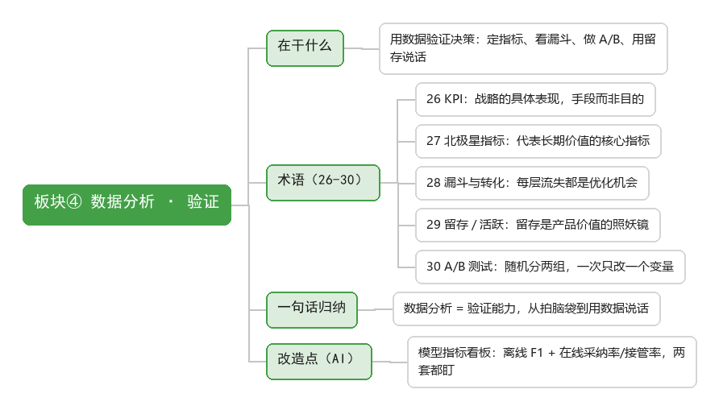

# 板块④ 数据分析 · 侧重点：验证

> 在干什么：用数据验证决策——定指标、看漏斗、做 A/B、用留存说话。

## 术语清单

| # | 术语 | 一句话 |
|---|------|--------|
| 26 | KPI | 战略的具体表现，本质是手段而非目的 |
| 27 | 北极星指标 | 一个能代表产品长期价值的核心指标 |
| 28 | 漏斗与转化 | 每层流失都是优化机会，先查流失最大的一层 |
| 29 | 留存 / 活跃 | 留存是产品价值的照妖镜 |
| 30 | A/B 测试 | 随机分两组对照，一次只改一个变量 |

## 一句话归纳

数据分析 = 验证能力，从拍脑袋决策到用数据说话。

## 改造点（AI）

模型指标看板：离线指标（F1/准确率）+ 在线指标（采纳率/任务完成率/人工接管率），两套都要盯；指标本身不是目的。
