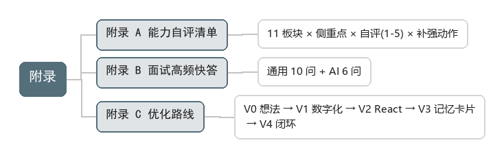

# 附录

## 附录 A：能力自评清单

11 个板块各一栏自评（1–5 分）+ 补强动作，用于定期查漏。

## 附录 B：面试高频问题快答

- 通用底座 10 问：什么是产品 / PM 每天干什么 / 用户说要 X 做不做 / 需求太多怎么排 / BRD-MRD-PRD-FSD 区别 / 新需求判断 / 项目延期 / 无职权推动 / 指标冲突 / 为什么是你。
- AI 增补层 6 问：能不能做 / 准不准 / 答错怎么办 / 怎么定价 / 护城河 / 上线把关。

## 附录 C：优化路线（React 化摘要）

核心判断：把导图/知识体系当产品运营，issues 就是用户反馈；git flow 把内容当代码管。

路线：V0 想法定稿 → V1 内容数字化（导图→JSON + README）→ V2 React 应用（浏览/搜索/索引）→ V3 背得下来（记忆卡片/自测）→ V4 持续优化闭环。
