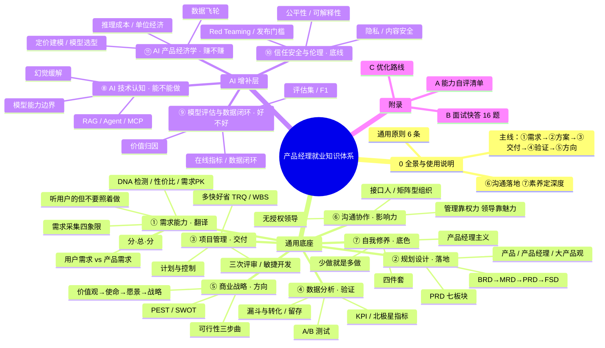

# 产品经理就业知识体系 · 思维导图（GitHub 可视化版）

> `.xmind` 是二进制，GitHub 无法预览。这里用 Mermaid 把同一份内容画成图，GitHub 直接渲染。
> 内容源：`板块式全书总结.md` / `能力自评清单大表.md` / `阶段式学习路径.md`，改内容请改这些源文件。

```mermaid
mindmap
  root((产品经理就业知识体系))
    0 全景与使用说明
      主线：①需求→②方案→③交付→④验证→⑤方向
      ⑥沟通落地 ⑦素养定深度
      通用原则 6 条
    通用底座
      ① 需求能力 · 翻译
        用户需求 vs 产品需求
        需求采集四象限
        DNA 检测 / 性价比 / 需求PK
        听用户的但不要照着做
        分·总·分
      ② 规划设计 · 落地
        产品 / 产品经理 / 大产品观
        BRD→MRD→PRD→FSD
        PRD 七板块
      ③ 项目管理 · 交付
        多快好省 TRQ / WBS
        三次评审 / 敏捷开发
        计划与控制
      ④ 数据分析 · 验证
        KPI / 北极星指标
        漏斗与转化 / 留存
        A/B 测试
      ⑤ 商业战略 · 方向
        可行性三步曲
        PEST / SWOT
        价值观→使命→愿景→战略
      ⑥ 沟通协作 · 影响力
        无授权领导
        接口人 / 矩阵型组织
        管理靠权力 领导靠魅力
      ⑦ 自我修养 · 底色
        四件套
        少做就是多做
        产品经理主义
    AI 增补层
      ⑧ AI 技术认知 · 能不能做
        模型能力边界
        RAG / Agent / MCP
        幻觉缓解
      ⑨ 模型评估与数据闭环 · 好不好
        评估集 / F1
        在线指标 / 数据闭环
        价值归因
      ⑩ 信任安全与伦理 · 底线
        公平性 / 可解释性
        隐私 / 内容安全
        Red Teaming / 发布门槛
      ⑪ AI 产品经济学 · 赚不赚
        推理成本 / 单位经济
        定价建模 / 模型选型
        数据飞轮
    附录
      A 能力自评清单
      B 面试快答 16 题
      C 优化路线
```
